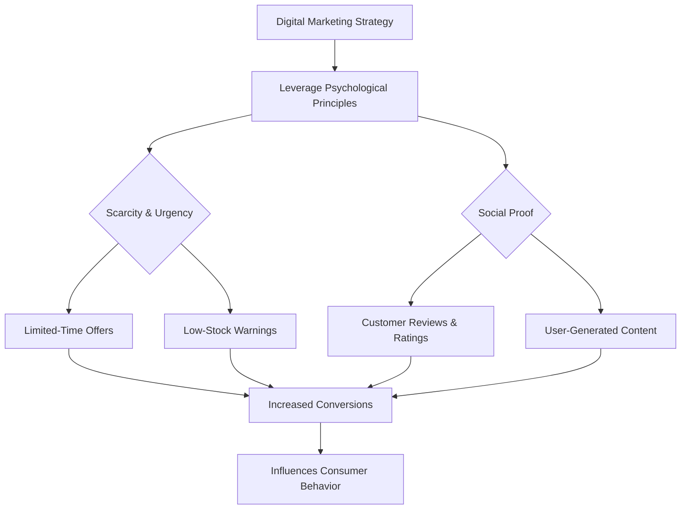
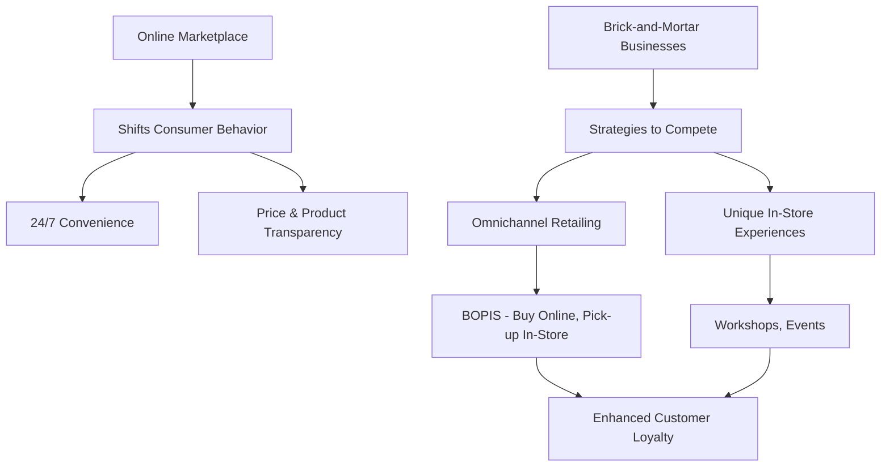
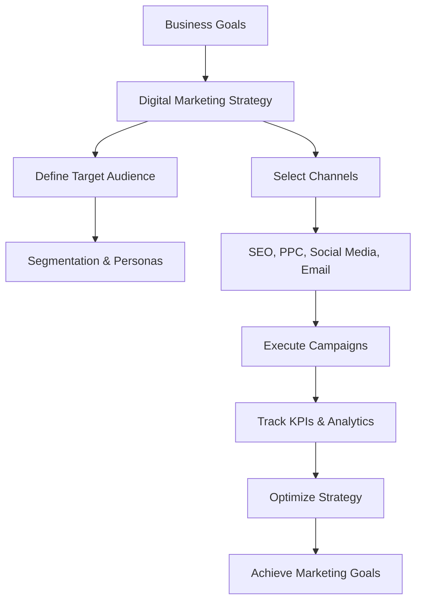
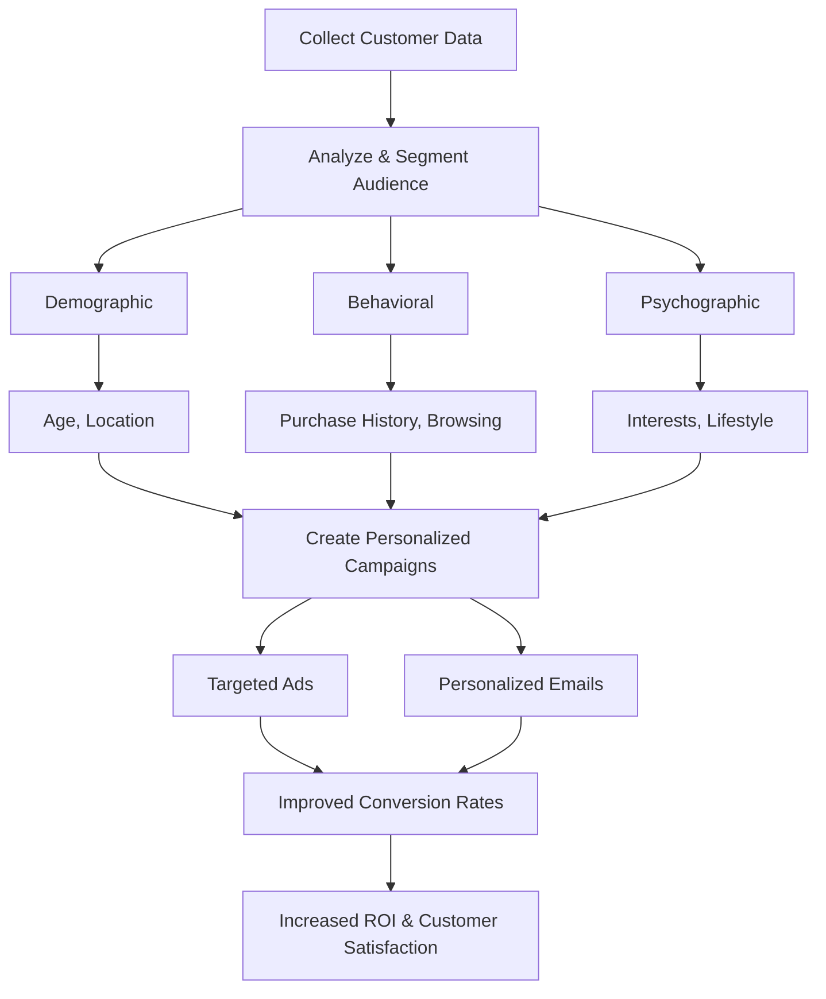
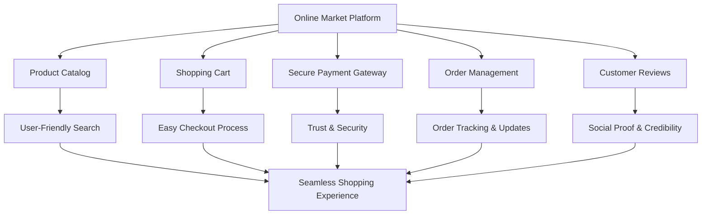
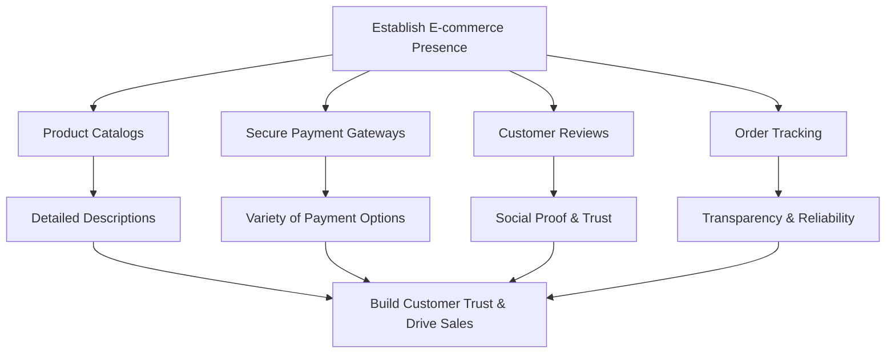
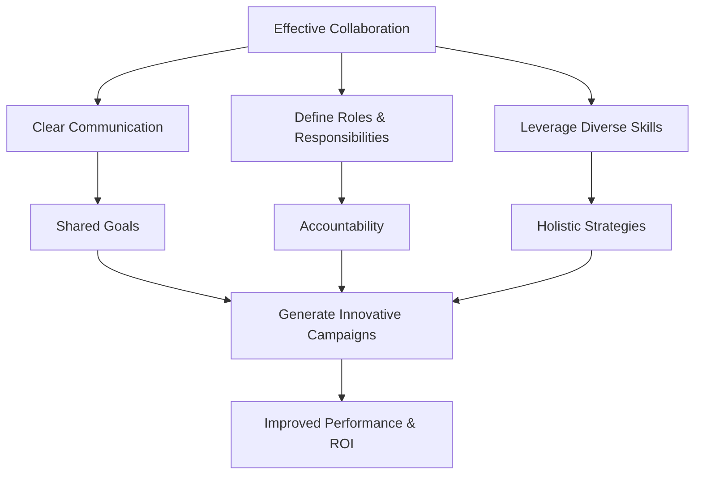
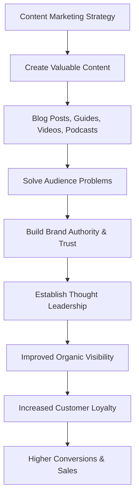
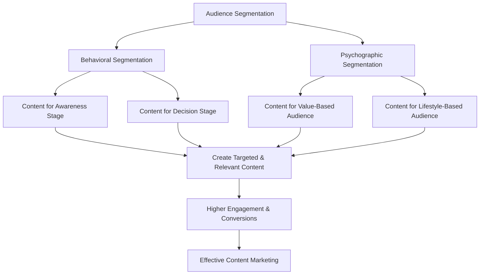

### 1\. Tailoring Digital Marketing to Influence Consumer Behavior

**Definition:**
**Digital marketing strategies** are designed to influence **consumer behavior** by leveraging psychological principles and data-driven insights. This involves moving a consumer through the **conversion funnel** from awareness to purchase and post-purchase engagement. Unlike traditional marketing, digital channels allow for real-time personalization, direct interaction, and precise targeting based on a user's digital footprint.

**Psychological Principles:**

1.  **Scarcity and Urgency:** This principle states that consumers are more likely to buy a product when it is limited in quantity or available for a limited time. Marketers leverage this by creating a sense of fear of missing out (**FOMO**).

      * **Example:** An e-commerce site displays a message like, "Only 3 items left in stock\!" or "Sale ends in 24 hours\!" This prompts an immediate purchase decision to avoid losing the opportunity.

2.  **Social Proof:** People are more likely to adopt a behavior or purchase a product if they see that others have already done so. This validates the product's quality and reduces perceived risk.

      * **Example:** A brand website features customer testimonials, user-generated content (UGC), high ratings (e.g., "4.9/5 stars based on 10,000+ reviews"), or badges like "Bestseller." This builds trust and encourages new customers to buy.

**Marketing Implications & Case Study:**
Leveraging these principles allows businesses to significantly increase **conversion rates** and **customer lifetime value (CLV)**. For instance, **Amazon** (2018-2023) consistently uses urgency by showing "order within the next X minutes for guaranteed delivery by tomorrow" and social proof through its extensive customer review and rating system, which is a core part of its product pages. This has a direct and measurable impact on their sales.

**Best Practices:**

  * **A/B Test** psychological triggers to see what resonates with your specific audience.
  * Combine scarcity with social proof (e.g., "1,000 people bought this in the last hour\! Only a few left.").
  * Ensure all claims are genuine and ethical to maintain long-term customer trust.

**Mermaid Diagram:**



**References:**

1.  [The Psychology Behind Social Media Marketing, HubSpot](https://www.google.com/search?q=https://blog.hubspot.com/marketing/psychology-social-media)
2.  IEEE Paper: *The Influence of Digital Marketing on Consumer Purchase Decision Process (2021)*

**Practice Questions:**

1.  Discuss two other psychological principles besides scarcity and social proof that digital marketers use.
2.  Explain how **personalization** in digital marketing leverages behavioral psychology.
3.  Critically analyze the ethical considerations of using psychological triggers in digital marketing.

-----

### 2\. Impact of Online Marketplace on Traditional Retail

**Definition:**
The **online marketplace** is a digital platform where multiple third-party sellers can sell products or services. The emergence of these platforms (e.g., Amazon, Flipkart) has fundamentally shifted **consumer behavior** by providing unparalleled convenience, wider product selection, and price transparency, directly challenging the traditional **brick-and-mortar** retail model.

**Impact on Consumer Behavior:**

  * **Shift to Convenience:** Consumers now expect 24/7 shopping, fast delivery, and hassle-free returns, which are standard features of online stores.
  * **Price and Product Transparency:** The ability to instantly compare prices and read thousands of reviews online has made consumers more informed and less loyal to a single brand or store.
  * **Demographic Shift:** The online marketplace has captured a large portion of the younger, digitally native consumer base, who prefer to research and purchase products online.

**Strategies for Brick-and-Mortar Businesses:**

1.  **Adopting an Omnichannel Strategy:** This involves creating a seamless shopping experience for the customer across all channels, both online and offline.

      * **Example:** A customer can browse products on the brand's website, check stock availability at a nearby physical store, and then pick it up in person (**BOPIS - Buy Online, Pick-up In-Store**). This combines the speed of online shopping with the immediacy of a physical store.

2.  **Creating In-Store Experiences:** Traditional stores can't compete on price and convenience alone. They must offer unique experiences that online stores cannot replicate.

      * **Example:** Retailers can host workshops, product demonstrations, or exclusive events. **Lululemon** (2019-2023) has successfully done this by offering free in-store yoga classes, which builds community and reinforces their brand identity beyond just selling apparel.

**Marketing Implications & Case Study:**
Traditional retailers must evolve from a product-centric to a customer-centric model. They can leverage their physical presence to create a competitive advantage. **Walmart** (2020-2023) is a prime example. It has heavily invested in its e-commerce platform and introduced services like "curbside pickup," successfully bridging the gap between its vast physical store network and its online presence. This has allowed it to compete directly with Amazon.

**Mermaid Diagram:**



**References:**

1.  [The Rise of Omnichannel Retail, Harvard Business Review](https://www.google.com/search?q=https://hbr.org/2019/04/the-rise-of-omnichannel-retail)
2.  Elsevier Paper: *Impact of E-commerce on the Viability of Traditional Retailing (2018)*

**Practice Questions:**

1.  Explain how **showrooming** and **webrooming** impact traditional retail.
2.  Discuss the role of **in-store technology** (e.g., smart mirrors, augmented reality) in modern brick-and-mortar stores.
3.  Analyze the challenges and opportunities for small, local businesses in the era of large-scale online marketplaces.

-----

### 3\. Defining a Digital Marketing Strategy

**Definition:**
A **digital marketing strategy** is a comprehensive plan that outlines how a business will achieve its marketing objectives using **online channels** and technologies. It is not just a list of tactics but a structured approach that defines the target audience, identifies the most effective channels, allocates resources, and sets key performance indicators (**KPIs**) to measure success.

**Importance of Adopting a Digital Marketing Strategy:**

  * **Goal Alignment:** It ensures all marketing activities, from **SEO** to **social media**, are working together towards a common goal (e.g., increasing online sales by 20% within a year). Without a strategy, efforts can be scattered and ineffective, leading to wasted resources.
  * **Targeted Audience Reach:** A strategy forces a business to identify its **target audience** and their online behavior. This allows for precise **segmentation** and targeting, leading to higher **ROI** as marketing messages are delivered to the right people at the right time. For example, a sports apparel brand might use a strategy to target fitness enthusiasts on Instagram and fitness-related search terms on Google.
  * **Competitive Advantage:** The online landscape is crowded. A well-defined strategy helps a business stand out by identifying its unique value proposition and communicating it effectively. It allows for proactive planning rather than reactive responses to market changes.
  * **Measurable Results:** Digital marketing is highly measurable. A strategy provides the **KPIs** to track performance, such as **Click-Through Rate (CTR)**, **Conversion Rate**, and **Cost Per Acquisition (CPA)**. This data allows for continuous optimization and improvement of campaigns.

**Marketing Implications & Case Study:**
Adopting a strategy allows businesses to make data-driven decisions. For instance, **Dollar Shave Club** (2012-2018) didn't just create a funny video; they had a clear digital strategy to disrupt the men's grooming market. Their approach was built around a subscription model, direct-to-consumer delivery, and leveraging content marketing (YouTube) to acquire a massive customer base, leading to their acquisition by Unilever for $1 billion.

**Mermaid Diagram:**



**References:**

1.  [Digital Marketing Strategy: A Guide, Neil Patel](https://www.google.com/search?q=https://neilpatel.com/blog/digital-marketing-strategy-guide/)
2.  IEEE Paper: *Strategic Planning in Digital Marketing and its Impact on Business Growth (2019)*

**Practice Questions:**

1.  Define the difference between a digital marketing strategy and a tactical plan.
2.  How does a digital marketing strategy help a startup with a limited budget compete with established players?
3.  Discuss the role of **A/B testing** in the continuous optimization phase of a digital marketing strategy.

-----

### 4\. Role of Customer Segmentation in Digital Marketing

**Definition:**
**Customer segmentation** is the process of dividing a broad target market into smaller, more defined groups of consumers who share similar characteristics. In digital marketing, this is done using **customer data and insights** to create personalized marketing campaigns that are more relevant and effective. Common segmentation criteria include demographics, psychographics, behavior, and geography.

**How Businesses Use Segmentation:**

1.  **Data Collection:** Businesses use analytics tools, CRM software, and website cookies to collect a wealth of **customer data**. This includes browsing history, purchase behavior, email engagement, and demographic information from social media profiles.
2.  **Audience Identification:** This data is analyzed to identify distinct customer groups. For example, an e-commerce store might identify segments like "first-time visitors," "repeat buyers," "high-value shoppers," and "cart abandoners."
3.  **Personalized Campaign Delivery:** Once segments are defined, marketers can create **tailored content** and messages. Instead of sending a generic email blast, they can send a personalized product recommendation email to a "repeat buyer" or a discount code to a "cart abandoner" to encourage them to complete their purchase. This personalized approach significantly increases **engagement rate** and **conversion rate**.

**Case Studies of Effective Segmentation:**

1.  **Netflix (2018-2023):** Netflix is a master of behavioral segmentation. It doesn't just segment by age or gender but by viewing behavior. Its recommendation engine analyzes what a user watches, when they watch it, and how they rate shows to create a hyper-personalized home screen. This reduces **customer churn** and keeps users engaged.
2.  **Spotify (2018-2023):** Spotify segments its users based on their music listening habits, creating highly personalized playlists like "Discover Weekly" and "Your Daily Mix." This is a key reason for its high user retention and the perception that the service "understands" the user's taste.

**Marketing Implications & Best Practices:**
Effective segmentation leads to higher **Return on Ad Spend (ROAS)**. It ensures that marketing messages resonate deeply with the audience. Best practices include starting with broad segmentation and refining it as more data becomes available, and continuously updating segments as customer behavior changes.

**Mermaid Diagram:**



**References:**

1.  [A Guide to Customer Segmentation, HubSpot](https://www.google.com/search?q=https://blog.hubspot.com/marketing/customer-segmentation-guide)
2.  IEEE Paper: *The Role of Behavioral Segmentation in Personalizing Digital Marketing (2020)*

**Practice Questions:**

1.  Discuss the difference between demographic and behavioral segmentation with examples.
2.  Justify why **hyper-personalization** is the next step beyond basic segmentation.
3.  Analyze the privacy and ethical challenges associated with collecting and using customer data for segmentation.

-----

### 5\. Key Components of an Online Market

**Definition:**
An **online market** is a virtual platform that facilitates commercial transactions between buyers and sellers over the internet. Its primary purpose is to create a seamless, user-friendly, and secure **e-commerce** experience. The key components work together as a cohesive system to guide a customer from product discovery to purchase completion.

**Key Components and Their Roles:**

1.  **Product Catalog & Search Functionality:** This is the digital storefront, displaying products with detailed descriptions, images, and prices. A robust **search engine** with filtering options is critical for customers to quickly find what they are looking for, which directly impacts the **user experience (UX)**.
2.  **Shopping Cart System:** This component allows users to temporarily store items they intend to purchase. It is the digital equivalent of a physical shopping cart and must be intuitive and easy to manage to prevent **cart abandonment**.
3.  **Secure Payment Gateway:** This is a crucial component that processes online payments. A **secure payment gateway** encrypts sensitive financial information (e.g., credit card details) to protect against fraud, building **customer trust**. Popular examples include Stripe, PayPal, and Razorpay.
4.  **Order Management & Tracking:** This system handles the processing of an order after a purchase. It provides customers with real-time updates on their order status (e.g., "processing," "shipped," "delivered"). This transparency reduces customer support queries and enhances the overall post-purchase experience.
5.  **Customer Reviews & Ratings:** This component allows customers to leave feedback on products. As a form of **social proof**, it helps potential buyers make informed decisions and builds credibility for both the product and the seller. A high volume of positive reviews can significantly increase **conversion rates**.

**Marketing Implications & Case Study:**
A well-integrated online market platform is essential for maximizing sales. A poor user experience, slow loading times, or a lack of trust can lead to high **bounce rates** and lost revenue. **Myntra** (2019-2023) in India is a strong example of a platform that has successfully integrated all these components. Its seamless UX, secure payment options, and robust order tracking have made it a leader in online fashion retail.

**Mermaid Diagram:**



**References:**

1.  [Essential Components of an E-commerce Website, Shopify](https://www.google.com/search?q=https://www.shopify.com/blog/ecommerce-website-essentials)
2.  Elsevier Paper: *Designing User-Centric E-commerce Platforms for Enhanced Customer Experience (2020)*

**Practice Questions:**

1.  Discuss the role of a **payment gateway** in building customer trust.
2.  Explain why a mobile-first design is crucial for a modern online market.
3.  Analyze the impact of slow website loading speed on a customer's online shopping experience.

-----

### 6\. Essential Components for E-commerce Presence

**Definition:**
When establishing an **e-commerce presence**, businesses must consider a set of essential components that not only facilitate transactions but also build a strong brand identity and foster **customer trust**. These features are the building blocks of a successful online store and are crucial for driving sales.

**Significance of Key Features:**

1.  **Product Catalogs:** A well-structured, easy-to-navigate product catalog is the foundation of any online store. It must include high-quality images, detailed product descriptions, and accurate pricing. The significance lies in creating a visually appealing and informative shopping experience that helps customers make a purchase decision.
2.  **Secure Payment Gateways:** This feature is arguably the most critical for building **customer trust**. A payment gateway must be not only secure but also offer a variety of payment options (e.g., credit/debit cards, net banking, digital wallets). Customers are more likely to abandon a purchase if they feel their financial information is at risk.
3.  **Customer Reviews:** **Customer reviews** are a powerful form of **social proof**. They provide unbiased feedback from other buyers, which can significantly influence a new customer's decision to purchase. Businesses should actively encourage and manage reviews as they build credibility and provide valuable insights into product quality and customer satisfaction.
4.  **Order Tracking:** The ability for a customer to track their order from the moment of purchase until delivery reduces anxiety and builds confidence in the brand's reliability. A transparent and reliable **order tracking system** is a key differentiator that enhances the post-purchase experience and reduces the burden on customer support.
5.  **User-Friendly Checkout Process:** A complex or lengthy checkout process is a leading cause of **cart abandonment**. The checkout must be intuitive, require minimal steps, and offer guest checkout options to streamline the purchase journey.

**Marketing Implications & Case Study:**
These components are not just technical features; they are powerful marketing tools. A seamless experience translates to higher **conversion rates** and better **customer retention**. For instance, **Zappos** (2018-2023) built its entire brand reputation on exceptional customer service, which includes hassle-free returns, free shipping, and transparent order tracking. This focus on the post-purchase experience built immense customer loyalty and made it a market leader.

**Mermaid Diagram:**



**References:**

1.  [The Most Important Features of an E-commerce Website, BigCommerce](https://www.google.com/search?q=https://www.bigcommerce.com/articles/ecommerce-website-features/)
2.  IEEE Paper: *The Impact of E-commerce Website Features on Consumer Trust and Purchase Intention (2021)*

**Practice Questions:**

1.  Explain the concept of **guest checkout** and why it's important for e-commerce.
2.  Discuss how a business can effectively manage negative customer reviews.
3.  Justify the importance of **mobile responsiveness** in the context of an e-commerce platform.

-----

### 7\. Opportunities for Building a Brand Website

**Definition:**
Building a **brand website** is a fundamental opportunity in the online market for a business to establish its digital home. Unlike a social media profile or an online marketplace storefront, a brand website provides complete control over the brand message, **user experience (UX)**, and customer data. It is a powerful tool for brand building and direct customer engagement.

**How a Brand Website Enhances Brand Visibility and Identity:**

1.  **Controlled Brand Identity:** A website offers a blank canvas to design and present the brand's visual identity, tone, and story without the constraints of a third-party platform. This control is crucial for creating a memorable and consistent brand image that resonates with the target audience.
2.  **Enhanced Brand Visibility:** A well-optimized website improves a brand's visibility on **Search Engine Results Pages (SERPs)**. By implementing **SEO best practices**, a brand website can attract **organic traffic** from potential customers actively searching for related products or information, which is often more cost-effective than paid advertising.
3.  **Direct Customer Relationship:** The website serves as a direct communication channel. It allows businesses to collect customer data (with consent), build email lists, and engage in direct conversations, bypassing the need for an intermediary. This direct relationship is essential for building **customer loyalty** and gathering valuable feedback.
4.  **Content Hub:** A brand website can host valuable content such as blogs, case studies, and tutorials. By providing informative and relevant content, a brand can establish itself as a **thought leader** in its industry, building trust and credibility. This is a key part of an effective **content marketing** strategy.

**Marketing Implications & Case Study:**
A brand website is an investment in long-term growth and brand equity. A strong website becomes a digital asset. **Apple** (2018-2023) is a prime example. Its website is a masterclass in minimalist design, high-quality visuals, and seamless navigation. It doesn't just sell products; it tells a story and reinforces the brand's core values of innovation and simplicity, attracting and retaining millions of customers.

**Mermaid Diagram:**

```mermaid
graph TD
A[Building a Brand Website] --> B[Full Brand Control]
A --> C[Enhanced Visibility (SEO)]
A --> D[Direct Customer Relationship]
A --> E[Become a Content Hub]
B --> F[Unique Brand Identity]
C --> G[Higher Organic Traffic]
D --> H[Data Collection, Loyalty]
E --> I[Thought Leadership]
F & G & H & I --> J[Attract Potential Customers & Build Trust]
```

**References:**

1.  [Why You Need a Brand Website, Neil Patel](https://www.google.com/search?q=https://neilpatel.com/blog/brand-website/)
2.  IEEE Paper: *The Role of a Brand Website in Building Digital Brand Equity (2020)*

**Practice Questions:**

1.  Explain how a brand website can be used to capture **leads** for a B2B business.
2.  Discuss the importance of a clear **Call-to-Action (CTA)** on a brand website.
3.  Analyze the trade-offs of using an online marketplace (e.g., Amazon) versus a dedicated brand website.

-----

### 8\. Integrating Social Media & Mobile Responsiveness

**Definition:**
Integrating **social media platforms** into a **BrandWebsite** means creating a symbiotic relationship where each platform drives traffic and engagement to the other. This strategy enhances brand visibility, builds community, and provides multiple touchpoints for customers. Additionally, **mobile responsiveness** and **cross-device compatibility** ensure a consistent and positive user experience, which is critical in a mobile-first world.

**Enhancing Brand Engagement with Social Media Integration:**

  * **Driving Traffic & Building Community:** A BrandWebsite can feature social media buttons that link directly to a brand’s profiles, encouraging visitors to follow the brand on their preferred platforms. Conversely, social media posts can direct traffic back to the website for blog posts, product pages, or special offers. This creates a powerful feedback loop.
  * **Leveraging Social Proof:** Embedding a live social media feed (e.g., an Instagram gallery of user-generated content) on the website showcases a vibrant, engaged community. This acts as a powerful form of **social proof**, encouraging new visitors to explore the brand and its products.
  * **Customer Service & Feedback:** Social media widgets can be integrated to allow for direct messaging or easy access to customer support channels. This makes it easier for customers to get help and for the brand to gather real-time feedback.

**Importance of Mobile Responsiveness:**

  * **User Experience (UX) and SEO:** Google's **mobile-first indexing** means that a website's mobile version is the primary one used for ranking. A non-responsive site will suffer in **SEO** rankings. A **mobile-friendly** design ensures a seamless user experience, which leads to lower **bounce rates** and higher **engagement rates**.
  * **Accessibility and Reach:** With over half of global web traffic coming from mobile devices (Statista, 2023), a website must be accessible and functional on smartphones and tablets. Lack of **cross-device compatibility** means a business is alienating a significant portion of its potential audience.
  * **Enhanced Conversions:** A fast-loading, easy-to-navigate mobile site leads to higher **conversion rates**. The easier it is for a user to browse products and complete a purchase on their phone, the more likely they are to buy.

**Marketing Implications & Case Study:**
A well-integrated, mobile-first BrandWebsite is a non-negotiable for success. **Starbucks** (2018-2023) has a robust digital strategy where its website, mobile app, and social media channels work in harmony. The mobile app, in particular, allows customers to order and pay ahead, driving in-store traffic and reinforcing brand loyalty.

**Mermaid Diagram:**

```mermaid
graph TD
A[Brand Website] --> B[Integrate Social Media]
A --> C[Ensure Mobile Responsiveness]
B --> D[Social Proof (UGC)]
B --> E[Traffic from Social Media]
C --> F[Mobile-First Indexing]
C --> G[Cross-Device Compatibility]
D --> H[Build Brand Trust]
E --> I[Increased Website Traffic]
F --> J[Improved SEO Ranking]
G --> K[Enhanced UX & Conversions]
H & I & J & K --> L[Enhanced Brand Engagement & Visibility]
```

**References:**

1.  [Why Mobile Responsiveness is Critical for SEO, Moz](https://www.google.com/search?q=https://moz.com/blog/mobile-first-indexing-guide)
2.  Elsevier Paper: *The Impact of Social Media Integration on Brand Engagement and Customer Loyalty (2020)*

**Practice Questions:**

1.  Explain the concept of a **social media wall** and its purpose on a BrandWebsite.
2.  Discuss the role of **user-generated content (UGC)** in social media integration.
3.  Analyze how a BrandWebsite can leverage social media for customer service and support.

-----

### 9\. Ensuring Effective Collaboration in Marketing Teams

**Definition:**
Effective **collaboration** within marketing teams is the process of ensuring that all members work together cohesively toward a shared goal during the planning and creation stages of **online marketing campaigns**. It goes beyond simply co-existing; it involves clear communication, defined roles, leveraging diverse skills, and using shared tools to generate innovative and successful strategies.

**Importance of Collaboration:**

1.  **Clear Communication & Defined Roles:** Miscommunication is a leading cause of campaign failure. Establishing clear roles (e.g., Content Strategist, SEO Specialist, Social Media Manager) and a robust communication framework (e.g., daily stand-ups, project management software) ensures everyone knows their responsibilities and the project's status.
2.  **Leveraging Diverse Skills and Expertise:** A modern marketing campaign requires a wide range of skills, from data analysis and design to copywriting and technical SEO. Collaboration allows a team to combine these specialized skills, leading to a more holistic and effective strategy. For example, the SEO specialist can provide keyword insights to the content writer, while the designer ensures the creative assets are visually compelling.
3.  **Generating Innovative Strategies:** Collaboration fosters a creative environment where ideas can be shared freely and built upon. A data analyst's insight into a high-performing keyword can inspire the social media manager to create a viral campaign, or a designer's new visual concept can lead to an innovative email marketing series. This synergy is crucial for standing out in a crowded market.
4.  **Agility and Problem Solving:** In the fast-paced digital world, campaigns often need to be adjusted on the fly. A collaborative team can quickly identify and address issues, whether it's a poor-performing ad or a sudden change in a platform's algorithm.

**Marketing Implications & Case Study:**
Poor collaboration leads to disjointed campaigns, inconsistent messaging, and wasted budget. Conversely, strong collaboration delivers cohesive campaigns that perform better. **Nike** (2018-2023) is known for its highly integrated marketing campaigns. Its teams, from product marketing to digital advertising, work in lockstep to launch campaigns like "Dream Crazier," ensuring the message is consistent across its website, social media, and digital advertising channels.

**Mermaid Diagram:**



**References:**

1.  [How to Improve Collaboration in Marketing Teams, HubSpot](https://www.google.com/search?q=https://blog.hubspot.com/marketing/improve-marketing-collaboration)
2.  IEEE Paper: *The Impact of Team Collaboration on Digital Marketing Campaign Success (2019)*

**Practice Questions:**

1.  Discuss the role of a shared **project management tool** (e.g., Asana, Trello) in improving team collaboration.
2.  Explain the concept of a **marketing scrum** and its benefits.
3.  Analyze the challenges of remote team collaboration in the context of creating a digital marketing campaign.

-----

### 10\. The Role of Data Analysis in Refining Marketing Strategies

**Definition:**
**Data analysis** and **performance measurement** are the processes of collecting, analyzing, and interpreting data to understand the effectiveness of **online marketing strategies**. This is done by tracking and evaluating **Key Performance Indicators (KPIs)**. The insights gained from this analysis are then used to refine and optimize campaigns for better results, making the process a continuous feedback loop.

**How Businesses Utilize Analytics and KPIs:**

1.  **Assessing Campaign Effectiveness:** Businesses use **analytics tools** (e.g., Google Analytics, social media insights dashboards) to track how users interact with their online presence. KPIs such as **Click-Through Rate (CTR)**, **Conversion Rate**, **Cost Per Click (CPC)**, and **Return on Ad Spend (ROAS)** provide a quantitative measure of campaign success. For example, a low CTR on a Google Ad might indicate a need to change the ad copy.
2.  **Identifying Areas for Improvement:** Data analysis helps pinpoint where a campaign is underperforming. For instance, a high **bounce rate** on a landing page suggests that the content is not meeting user expectations, or the page is loading too slowly. This insight prompts marketers to improve the content, design, or technical performance of the page.
3.  **Optimizing for Better Results:** The most crucial role of data analysis is optimization. By testing different variations of a campaign (**A/B testing**), marketers can identify which elements (e.g., ad copy, image, call-to-action) perform best. This iterative process of testing, analyzing, and refining leads to a continuous improvement in **ROI**.
4.  **Informed Budget Allocation:** By understanding which channels and campaigns are delivering the best **ROAS**, marketers can strategically reallocate their budget. This ensures that money is spent on the most profitable activities, maximizing the overall return.

**Marketing Implications & Case Study:**
Without data analysis, a marketing strategy is based on guesswork. **Airbnb** (2018-2023) is a great example of a company that is heavily data-driven. It continuously analyzes user behavior on its platform to refine its recommendation algorithms and marketing messages, leading to a more personalized user experience and higher booking rates.

**Mermaid Diagram:**

```mermaid
graph TD
A[Digital Marketing Strategy] --> B[Launch Campaigns]
B --> C[Collect Data with Analytics Tools]
C --> D[Analyze KPIs (CTR, Conversion Rate, etc.)]
D --> E{Identify Underperforming Areas}
E --> F[Optimize Content, Ads, & Channels]
F --> G[Refine Strategy]
G --> B
```

**References:**

1.  [KPIs for Digital Marketing, Search Engine Journal](https://www.google.com/search?q=https://www.searchenginejournal.com/digital-marketing-kpis-to-track/282479/)
2.  IEEE Paper: *The Role of Data-Driven Decision Making in Digital Marketing (2021)*

**Practice Questions:**

1.  Explain the difference between a **vanity metric** and an actionable KPI.
2.  Discuss how a business can use **customer lifetime value (CLV)** as a KPI.
3.  Analyze the role of **attribution modeling** in understanding the customer journey across multiple touchpoints.

-----

### 11\. Role of Content Marketing in Building Brand Authority

**Definition:**
**Content marketing** is a strategic marketing approach focused on creating and distributing valuable, relevant, and consistent content to a clearly defined audience. Its primary goal is not to sell but to build **brand authority** and **thought leadership** by providing expertise and gaining the trust of the target audience.

**How Businesses Use Content to Build Authority and Trust:**

  * **Establishing Industry Expertise:** By creating high-quality, informative content—such as detailed blog posts, research reports, webinars, or whitepapers—a business demonstrates its deep understanding of its industry. For example, a cybersecurity firm publishing a whitepaper on emerging threats positions itself as an expert and a reliable source of information.
  * **Gaining Audience Trust:** When a brand consistently provides valuable information for free, it builds trust and goodwill with its audience. This trust is a crucial precursor to a purchase. When a customer is ready to buy, they are more likely to choose the brand they already trust and see as an authority.
  * **Improving SEO and Organic Visibility:** Search engines like Google prioritize high-quality, informative content. By creating content that answers common questions and solves problems for their audience, businesses can improve their **organic search rankings**, driving qualified **organic traffic** to their website and establishing their authority in the online market.
  * **Supporting the Sales Funnel:** Content can be mapped to different stages of the **sales funnel**. Educational blog posts can attract new visitors (Awareness stage), while case studies and customer testimonials can help convert leads (Consideration/Decision stage).

**Examples of Brands that Effectively Used Content Marketing:**

1.  **HubSpot (2018-2023):** HubSpot is a content marketing powerhouse. Its blog, guides, and free tools are a go-to resource for millions of marketers worldwide. By providing immense value for free, it has established itself as the leading authority in inbound marketing, and its blog is a primary driver of leads for its software.
2.  **Red Bull (2018-2023):** Red Bull’s content strategy is a masterclass in brand authority. It doesn't focus on its energy drink but on extreme sports, adventure, and music. By creating spectacular content (e.g., Felix Baumgartner's space jump), Red Bull has positioned itself as an authoritative voice in adventure sports and a brand that lives up to its "gives you wings" motto.

**Mermaid Diagram:**



**References:**

1.  [The Ultimate Guide to Content Marketing, HubSpot](https://blog.hubspot.com/marketing/content-marketing)
2.  IEEE Paper: *The Impact of Content Marketing on Brand Image and Consumer Engagement (2020)*

**Practice Questions:**

1.  Explain the difference between **inbound marketing** and outbound marketing.
2.  Discuss the role of a **content calendar** in a content marketing strategy.
3.  Analyze the importance of **user-generated content (UGC)** in building brand authority.

-----

### 12\. The Role of Audience Segmentation in Content Marketing

**Definition:**
**Audience segmentation** is the practice of dividing a target audience into smaller, more specific groups based on shared characteristics. In **content marketing**, this is crucial because it allows marketers to create more targeted and effective content that directly addresses the unique needs, interests, and pain points of each segment. A one-size-fits-all approach to content is often ineffective and can lead to low **engagement rates** and wasted effort.

**Two Different Methods of Audience Segmentation:**

1.  **Behavioral Segmentation:** This method groups the audience based on their actions, behaviors, and interactions with the brand. It is one of the most powerful forms of segmentation for content marketing because it is based on actual user behavior.

      * **How it helps:** A business can create content tailored to the different stages of the **buyer's journey** (**conversion funnel**). For instance, a software company could create a blog post titled "Top 5 Business Challenges" for visitors in the **awareness stage** (problem identification), and then a detailed case study or a product demo video for users in the **decision stage** (product evaluation). This ensures the content is highly relevant to where the user is in their journey.

2.  **Psychographic Segmentation:** This method segments the audience based on psychological traits such as interests, values, attitudes, and lifestyle. While more difficult to quantify than behavioral or demographic data, it provides deeper insights into the "why" behind a user's actions.

      * **How it helps:** This method is ideal for crafting compelling brand stories and emotional content. A sustainable fashion brand, for example, can segment its audience into groups like "eco-conscious consumers" and "trend followers." The content for the former would focus on ethical sourcing and environmental impact, while the content for the latter would emphasize style and celebrity endorsements. This approach ensures the brand message resonates deeply with each segment's core values.

**Marketing Implications:**
By using segmentation, businesses can improve their content's **relevance** and **effectiveness**. This leads to higher **CTR**, better **engagement metrics**, and ultimately, a more efficient use of marketing resources. It allows a brand to move from broadcasting a generic message to having a series of meaningful conversations with different groups within its audience.

**Mermaid Diagram:**



**References:**

1.  [Audience Segmentation for Content Marketing, Content Marketing Institute](https://www.google.com/search?q=https://contentmarketinginstitute.com/articles/audience-segmentation-content/)
2.  Elsevier Paper: *Psychographic and Behavioral Segmentation: A Digital Marketing Perspective (2020)*

**Practice Questions:**

1.  Discuss the limitations and challenges of using **demographic segmentation** alone in content marketing.
2.  Explain how **social media listening** can be used to gather data for psychographic segmentation.
3.  Analyze how a B2B company can use a combination of behavioral and firmographic segmentation for its content strategy.
