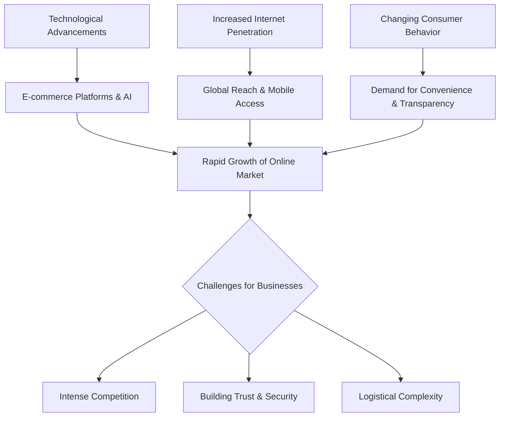
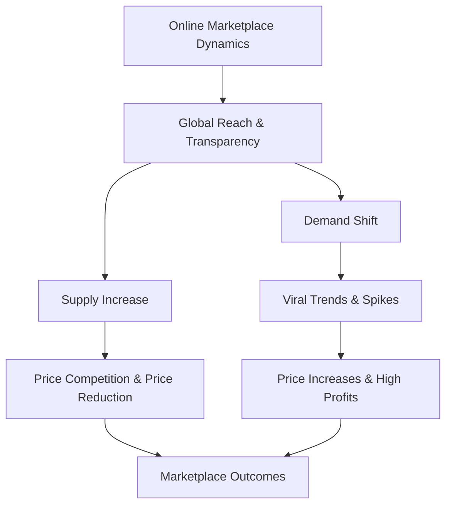
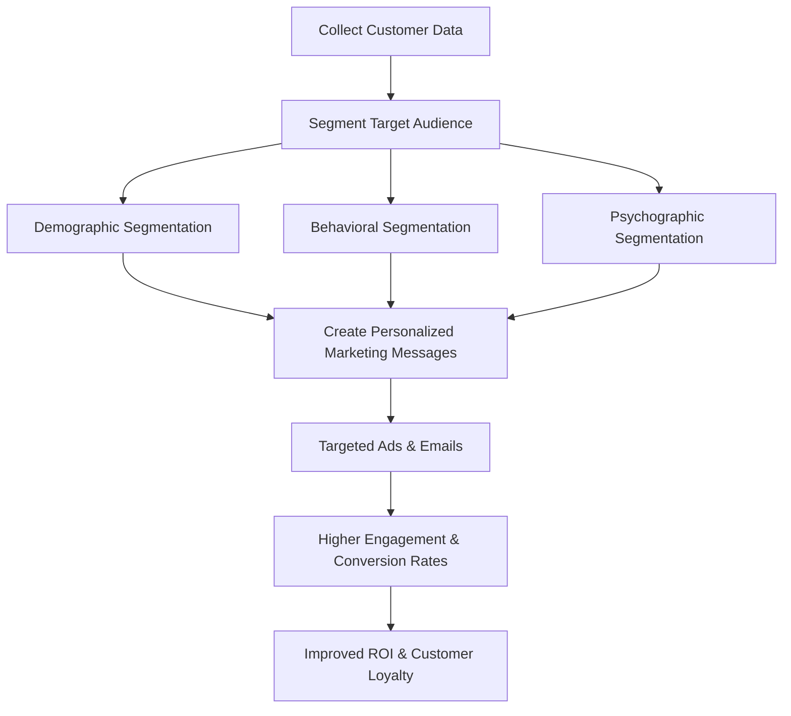
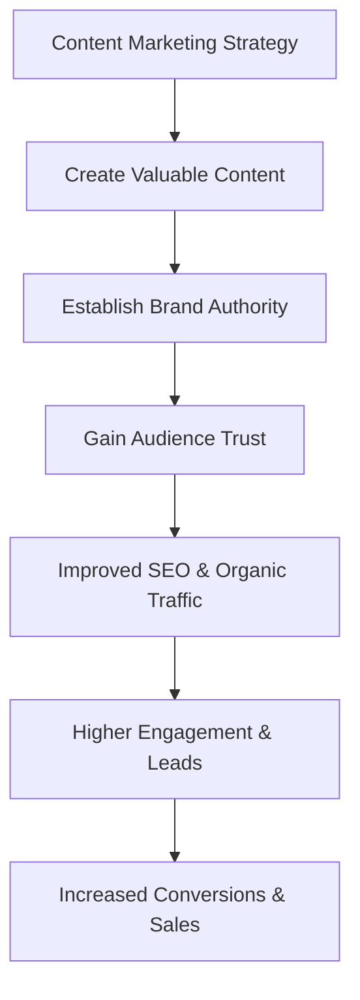

### 1\. Factors Contributing to the Growth of the Online Market

**Definition:**
The **online market space** is a virtual environment where commercial activities, including buying and selling goods, services, and information, are conducted over the internet. Its rapid growth is a direct result of the interplay between technological advancements, widespread internet access, and a fundamental shift in **consumer behavior**.

**Key Contributing Factors:**

1.  **Advancements in Technology:**

      * The development of powerful and secure **e-commerce platforms** (e.g., Shopify, Magento) has made it easier for businesses of all sizes to set up online stores.
      * Innovations in **mobile technology** have enabled shopping on the go, making the online market accessible 24/7. Mobile transactions now account for a significant portion of all e-commerce sales (Statista, 2023).
      * Technologies like **AI** and **machine learning** have enabled highly personalized shopping experiences, dynamic pricing, and efficient logistics, increasing customer satisfaction and sales.

2.  **Increased Internet Penetration:**

      * Global internet access has expanded dramatically, particularly in developing nations, creating a vast and new consumer base. This has reduced geographic barriers and opened up a global marketplace for businesses.
      * The proliferation of affordable smartphones and data plans has made the internet, and thus the online market, accessible to a wider demographic than ever before.

3.  **Changing Consumer Behavior:**

      * Consumers now prioritize **convenience, speed, and transparency**. The ability to compare prices, read reviews, and get products delivered to their doorstep without leaving home has become a primary expectation.
      * The rise of **digital natives** (Gen Z and Millennials) who are comfortable with online transactions has fueled the growth. They often prefer to research and purchase products online, influenced by social media and online reviews.

**Challenges for Businesses:**
Navigating this dynamic environment presents several challenges:

  * **Intense Competition:** The low barrier to entry means the market is saturated with competitors, making **brand differentiation** a key challenge.
  * **Building Trust:** The impersonal nature of online transactions makes it difficult to build **customer trust**, especially for new brands. Concerns over data privacy and security are significant hurdles.
  * **Logistics and Supply Chain:** Managing returns, shipping costs, and last-mile delivery efficiently is a complex challenge, especially for global operations.
  * **Data Privacy and Ethics:** Businesses must navigate evolving regulations like **GDPR** and ensure ethical use of consumer data to avoid fines and reputational damage.

**Mermaid Diagram:**



**References:**

1.  [The Evolution of E-commerce, Shopify](https://www.google.com/search?q=https://www.shopify.com/enterprise/history-of-ecommerce)
2.  Elsevier Paper: *Technological Drivers and Consumer Adoption of the Online Marketplace (2020)*

**Practice Questions:**

1.  Justify the statement, "The smartphone has been the single most important factor in the growth of the online market."
2.  Discuss the role of **blockchain technology** in addressing trust and security challenges in the online marketplace.
3.  Analyze the impact of increased global competition on pricing strategies for online businesses.

-----

### 2\. Brand Differentiation through Website Design and UX

**Definition:**
**Brand differentiation** is the process of creating a unique brand identity that sets a business apart from its competitors in the minds of consumers. In the online market, a business's **website design** and **user experience (UX)** are crucial tools for achieving this. They are not just functional elements but powerful marketing assets that convey brand values, personality, and professionalism.

**Using Visual Elements for Brand Identity:**

  * **Color Schemes:** Colors evoke emotions and associations. A premium brand might use a minimalist palette (e.g., black, white, gray) to convey sophistication, while a playful brand might use vibrant, bold colors. **Tiffany & Co.**'s signature blue is an iconic example of using color for instant brand recognition.
  * **Typography:** The choice of fonts communicates brand personality. A clean, sans-serif font might suggest a modern, tech-focused brand, while a more ornate serif font could convey tradition and elegance.
  * **Visual Elements and Imagery:** High-quality, consistent imagery (photography, illustrations) tells a brand's story. **Patagonia**'s website features rugged, authentic photography of people enjoying the outdoors, which reinforces its brand identity as an outdoor apparel company committed to environmental causes.

**The Role of UX in Maximizing Engagement and Conversions:**
**User Experience (UX)** refers to the overall feeling a person has when using a website. A great UX makes a site easy, intuitive, and enjoyable to use.

  * **Intuitive Navigation:** A clear, logical navigation menu helps users find information quickly, reducing frustration and **bounce rates**. An excellent example is **Airbnb**, whose simple and effective search and booking process guides users effortlessly through the **conversion funnel**.
  * **Mobile Responsiveness:** A website that adapts seamlessly to all screen sizes ensures a consistent experience for all users. With Google's **mobile-first indexing**, this is also a critical **SEO** factor.
  * **Usability and Accessibility:** Features like fast loading times, clear **Calls-to-Action (CTAs)**, and easy-to-read text are essential for usability. A positive UX builds **customer trust** and encourages repeat visits and purchases. A study by Forrester (2018) found that every dollar invested in UX can yield a return of $100.

**Marketing Implications & Case Study:**
A poor website design and UX can damage a brand's credibility, regardless of the quality of its products. Conversely, a well-designed site can be a brand's most powerful salesperson. **Apple** (2018-2023) consistently uses a minimalist design, premium imagery, and a seamless UX on its website. This approach reinforces its brand identity as a premium, user-friendly technology company, leading to high engagement and conversion rates.

**Mermaid Diagram:**

```mermaid
graph TD
A[Website Design & UX] --> B[Visual Elements]
A --> C[User Experience (UX)]
B --> D[Color Schemes & Typography]
B --> E[Imagery & Brand Story]
C --> F[Intuitive Navigation]
C --> G[Mobile Responsiveness & Speed]
D & E --> H[Unique Brand Identity]
F & G --> I[Maximize Engagement & Conversions]
H & I --> J[Brand Differentiation & Positioning]
```

**References:**

1.  [The Importance of UX in Web Design, HubSpot](https://www.google.com/search?q=https://blog.hubspot.com/website/ux-design)
2.  IEEE Paper: *The Impact of Website Design and Usability on Brand Perception (2021)*

**Practice Questions:**

1.  Explain the concept of **A/B testing** in website design and how it can be used to improve UX.
2.  Discuss the role of **microinteractions** in creating a memorable user experience.
3.  Justify why a fast-loading website is a non-negotiable for modern e-commerce.

-----

### 3\. Supply and Demand in an Online Marketplace

**Definition:**
**Supply and demand** is a fundamental economic principle that describes the relationship between the availability of a product (supply) and the desire for it (demand) and its effect on the product's price. In an **online marketplace**, this dynamic is amplified by factors such as global reach, instant price comparison, and real-time data, leading to faster and more significant shifts.

**How Dynamics Influence Marketplace Outcomes:**

  * **Global Supply:** The online market removes geographical barriers, allowing a seller in one country to meet demand in another. This increases overall supply and can drive prices down due to competition.
  * **Instant Price Transparency:** Online marketplaces and price comparison tools empower consumers to find the best deal instantly. This forces suppliers to be more competitive on price, often leading to a **price war**.
  * **Real-Time Data:** Businesses can track demand in real-time, allowing them to adjust their prices and inventory instantly. This dynamic pricing model is a key feature of the online market.

**Real-World Examples:**

1.  **Shift in Supply: The Rise of Drop-Shipping (2018-2023)**

      * **Scenario:** A massive increase in the number of **drop-shippers** on platforms like Shopify and Amazon's FBA (Fulfillment by Amazon) has flooded the market with a high supply of low-cost, generic products (e.g., phone accessories, fidget spinners).
      * **Impact:** This surge in supply, often from a single manufacturer in another country, has driven down the prices for these products. The intense competition among thousands of sellers offering the same item has made it difficult for any single seller to stand out, forcing them to compete almost solely on price.

2.  **Shift in Demand: The "Squid Game" Effect (2021)**

      * **Scenario:** Following the immense popularity of the Netflix series **"Squid Game,"** there was a sudden and massive spike in online demand for specific products, such as green tracksuits and dalgona candy molds.
      * **Impact:** The sudden shift in demand far outpaced the existing supply, leading to a significant increase in prices for these items on marketplaces like eBay and Amazon. Sellers who could quickly source and list these products saw a massive increase in sales and profits. This is a classic example of how a viral trend can create a temporary but highly profitable online market.

**Mermaid Diagram:**



**References:**

1.  [The Role of Supply and Demand in E-commerce, Investopedia](https://www.google.com/search?q=https://www.investopedia.com/articles/investing/032916/supply-and-demand-ecommerce.asp)
2.  IEEE Paper: *Price Volatility in E-commerce Marketplaces due to Supply and Demand Fluctuations (2020)*

**Practice Questions:**

1.  Explain how **surge pricing** (e.g., on Uber) is a real-world application of dynamic supply and demand.
2.  Discuss the impact of **AI-driven dynamic pricing** on consumer behavior in an online marketplace.
3.  Analyze the role of **online reviews** and **ratings** in influencing demand for a product.

-----

### 4\. Customer Segmentation in Online Marketing Campaigns

**Definition:**
**Customer segmentation** is the process of dividing a broad target market into smaller, more specific groups of consumers who share similar characteristics. In the context of online marketing campaigns, it is a critical strategy during the **planning and creation** stages to ensure that marketing messages are **personalized** and relevant, leading to higher campaign effectiveness and better **ROI**.

**How Businesses Use Customer Data for Segmentation:**

1.  **Data Collection:** Businesses use a variety of tools to collect customer data, including:

      * **Website Analytics:** Tracking user behavior, such as pages visited and time spent on site.
      * **CRM (Customer Relationship Management) Systems:** Storing customer information like purchase history and contact details.
      * **Social Media Insights:** Gathering demographic and interest-based data.
      * **Email Marketing Software:** Tracking open rates, click-through rates, and unsubscribes.

2.  **Effective Segmentation:** This data is then used to create various segments:

      * **Demographic Segmentation:** Based on age, gender, location, income, etc. (e.g., targeting a product for young men in urban areas).
      * **Behavioral Segmentation:** Based on user actions, such as browsing history, purchase frequency, cart abandonment, etc. (e.g., creating a campaign for customers who haven't purchased in 90 days).
      * **Psychographic Segmentation:** Based on lifestyle, values, interests, and personality (e.g., targeting content about sustainability to eco-conscious consumers).

**Benefits of Tailored Marketing Strategies:**

  * **Higher Engagement:** Personalized emails, ads, and content are far more likely to be opened, clicked, and engaged with. For example, a segmented email has a **50% higher CTR** than a generic one (HubSpot, 2022).
  * **Improved Conversion Rates:** By delivering a message that directly addresses a specific segment's needs, businesses can significantly increase the likelihood of a sale. A personalized product recommendation on an e-commerce site is a classic example.
  * **Increased Customer Loyalty:** When customers feel that a brand understands them and their needs, it fosters a stronger relationship and builds **customer loyalty**.
  * **Reduced Ad Spend:** By targeting the right audience, businesses avoid wasting money on irrelevant ads, leading to a higher **Return on Ad Spend (ROAS)**.

**Marketing Implications & Case Study:**
Segmentation is the cornerstone of modern digital marketing. **Netflix** (2018-2023) is a prime example. Its personalized recommendation engine is a highly effective form of behavioral segmentation. By analyzing viewing habits, it tailors content recommendations for each user, which is a major factor in its high user retention and low **customer churn rate**.

**Mermaid Diagram:**



**References:**

1.  [The Ultimate Guide to Customer Segmentation, HubSpot](https://www.google.com/search?q=https://blog.hubspot.com/marketing/customer-segmentation-guide)
2.  IEEE Paper: *The Impact of Customer Segmentation on Digital Marketing Campaign Performance (2019)*

**Practice Questions:**

1.  Explain the concept of **marketing personas** and how they relate to audience segmentation.
2.  Discuss the ethical challenges of using customer data for highly specific segmentation.
3.  Analyze how a B2B company might use customer segmentation differently than a B2C company.

-----

### 5\. The Significance of Content Marketing

**Definition:**
**Content marketing** is a strategic marketing approach focused on creating and distributing valuable, relevant, and consistent content to attract and retain a defined audience. It is a long-term strategy centered on providing value rather than directly selling. The ultimate goal is to build **brand authority** and **thought leadership**, thereby earning the trust and loyalty of potential customers.

**Significance in Modern Digital Marketing:**

  * **Building Brand Authority and Trust:** In a crowded online marketplace, content marketing allows a brand to establish itself as an expert in its field. By creating informative blogs, detailed guides, or engaging videos, a brand can answer a user's questions and solve their problems. This positions the brand as a credible and trustworthy source, which is a significant competitive advantage.
  * **Driving Organic Traffic:** Search engines like Google prioritize high-quality, relevant content. A robust content marketing strategy that includes **SEO best practices** (e.g., keyword optimization, high-quality backlinks) can significantly improve a website's **organic rankings** and visibility, driving qualified leads without paying for advertising.
  * **Enhancing Customer Engagement:** Content provides a means for brands to have a conversation with their audience. Social media posts, interactive quizzes, or webinars encourage interaction and feedback, building a community around the brand and fostering a deeper relationship.
  * **Supporting the Customer Journey:** Content can be created for every stage of the **conversion funnel**. A blog post can attract a user in the **awareness stage**, a case study can influence a user in the **consideration stage**, and a product demo video can help a user in the **decision stage** make a purchase.

**Examples of Successful Content Marketing Campaigns:**

1.  **Red Bull's "Stratos" Project (2012):** This campaign wasn't about selling an energy drink; it was about brand experience. Red Bull sponsored Felix Baumgartner's record-breaking freefall from the edge of space. The live broadcast and subsequent content (videos, documentaries) generated unprecedented global attention. This campaign cemented Red Bull's brand as an authoritative voice in extreme sports and adventure, perfectly aligning with its brand image.
2.  **HubSpot's Inbound Marketing Blog (2018-2023):** HubSpot built its entire business on content marketing. Its blog is a go-to resource for millions of marketers worldwide, offering free, valuable, and comprehensive guides on topics like **SEO, social media, and email marketing**. By providing this immense value, HubSpot has positioned itself as the leading authority in inbound marketing, and its blog serves as a massive lead generation engine for its software products.

**Mermaid Diagram:**



**References:**

1.  [What is Content Marketing?, Content Marketing Institute](https://contentmarketinginstitute.com/what-is-content-marketing/)
2.  Elsevier Paper: *The Strategic Role of Content Marketing in Building Digital Brand Equity (2018)*

**Practice Questions:**

1.  Explain the concept of a **content calendar** and its role in a content marketing strategy.
2.  Discuss the importance of **video marketing** in modern content strategies.
3.  Analyze the difference between **paid content promotion** and **organic content marketing**.
