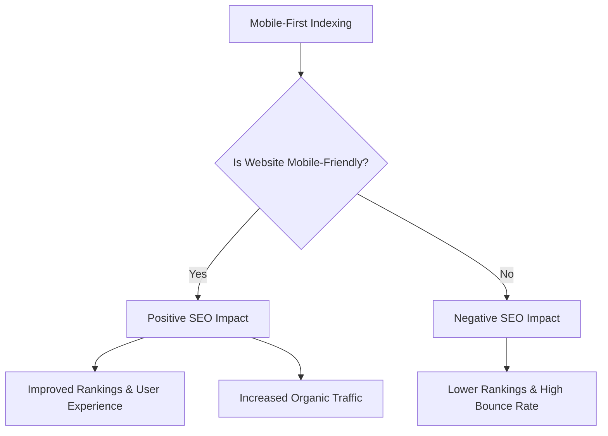
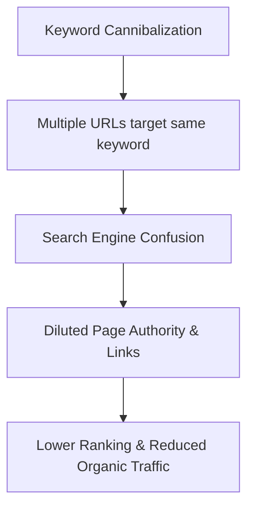
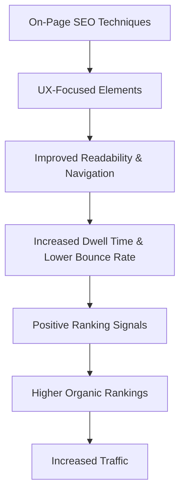
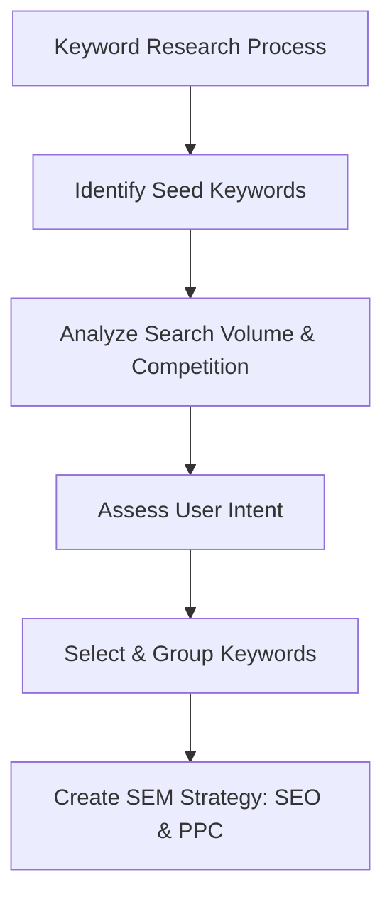
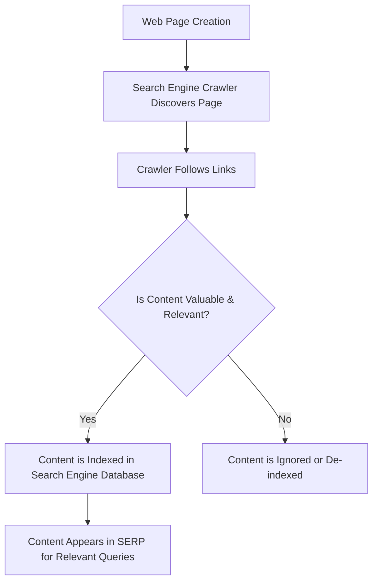
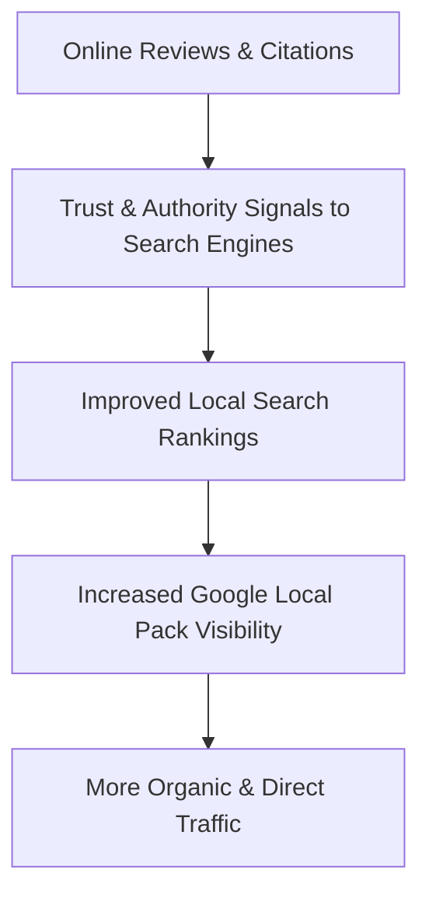
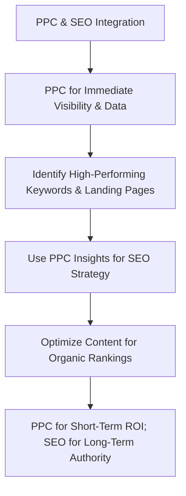
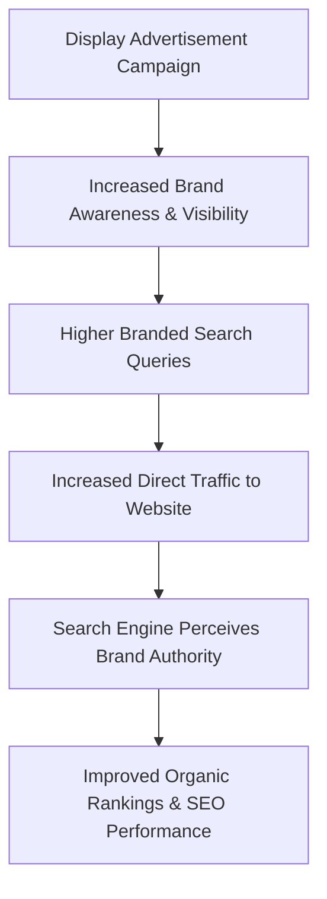
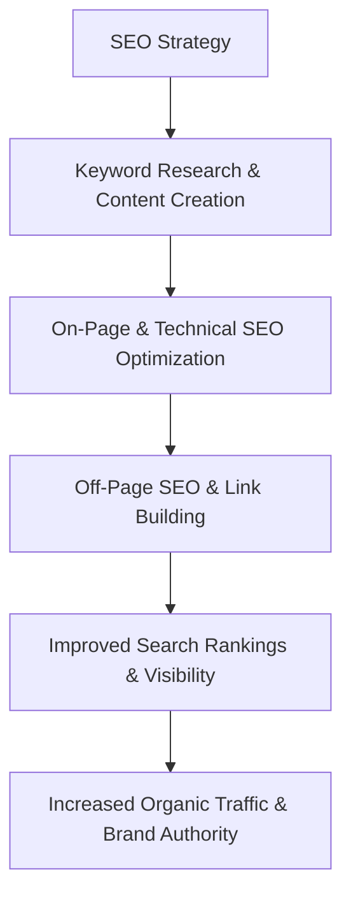
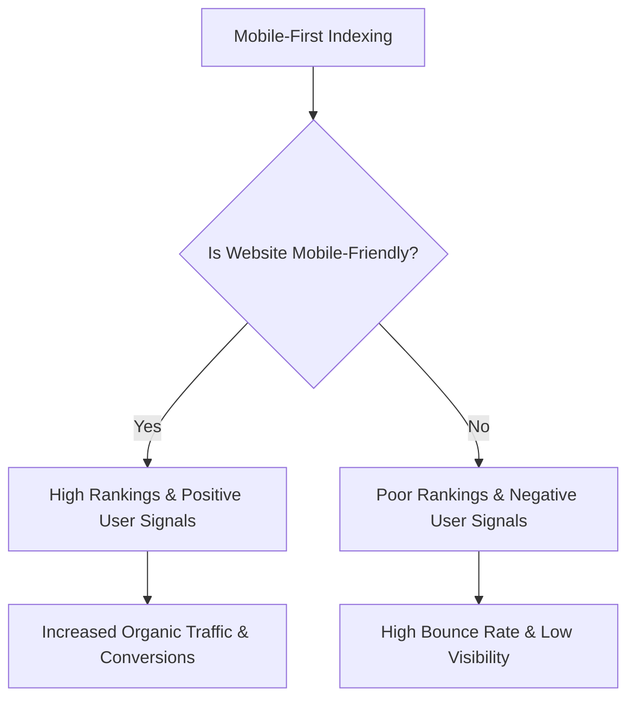

### 1\. Describe the concept of mobile optimization in SEO and its importance in the era of mobile-first indexing. Provide three key elements that contribute to a well-optimized mobile website.

**Definition:**

**Mobile optimization** is the process of ensuring that a website is easily accessible and provides a seamless user experience for visitors on mobile devices like smartphones and tablets. It involves adapting a website's design, content, and functionality to fit smaller screens, faster loading times, and touch-based navigation. Its importance is amplified by **mobile-first indexing**, a shift by Google where the search engine primarily uses the mobile version of a website for crawling, indexing, and ranking.

**Simple Example:**

Imagine a restaurant's website. On a desktop, the menu might be a large PDF file. For a mobile-optimized site, this PDF is replaced by an easily scrollable, text-based menu with large buttons for "Call to Order" or "Get Directions." This small change significantly improves the mobile user experience.

**Diagram:**



**Key Elements for Mobile Optimization:**

1.  **Responsive Design:** This is a design approach that makes the website's layout and content adjust automatically to the screen size of the device. Instead of creating a separate mobile site (https://www.google.com/search?q=m.example.com), a single URL serves all devices, simplifying SEO efforts and ensuring a consistent user experience. This includes using **flexible grids**, **images**, and CSS media queries.

2.  **Fast Loading Speed:** Mobile users expect pages to load in under 3 seconds. Slow speeds lead to high **bounce rates** and poor rankings. To achieve this, digital marketers optimize images, minimize CSS and JavaScript files, and leverage browser caching. Google's **Core Web Vitals** explicitly measures loading performance metrics like Largest Contentful Paint (LCP).

3.  **User-Friendly Interface (UX):** A good mobile interface includes clear, clickable buttons with adequate spacing, legible font sizes, and a simplified navigation menu (e.g., a "hamburger" menu). Content should be scannable with short paragraphs and bullet points. **Pop-ups** and intrusive ads should be avoided to prevent a frustrating user experience.

**Real-World Case:**

In 2019, **The Washington Post** redesigned its website with a focus on mobile optimization. By adopting a **responsive design** and improving page load speeds, they saw a **23% increase in mobile pageviews** and a significant improvement in their mobile search rankings. This case highlights how a strong mobile experience translates directly into higher engagement and organic traffic.

**Best Practices:**

  * Regularly test your website's mobile-friendliness using Google's Mobile-Friendly Test tool.
  * Prioritize improving your **Core Web Vitals** scores, especially LCP and Cumulative Layout Shift (CLS).
  * Avoid using Flash, and ensure all mobile content is crawlable by search engines.

**References:**

1.  [HubSpot Blog: The Ultimate Guide to Mobile SEO](https://www.google.com/search?q=https://blog.hubspot.com/marketing/mobile-seo)
2.  IEEE Paper: *A study of Mobile-First Indexing and its impact on SEO (2021)*

**Practice Questions:**

1.  Justify why **responsive design** is considered a superior approach to creating a separate mobile site for SEO purposes.
2.  Explain the relationship between **mobile optimization** and **user experience (UX)**.
3.  Discuss how Google's **Core Web Vitals** directly influence a website's mobile search ranking.

-----

### 2\. Elaborate on the concept of keyword cannibalization and its detrimental impact on SEO. Provide three strategies to identify and resolve keyword cannibalization issues on a website.

**Definition:**

**Keyword cannibalization** is an SEO issue where multiple pages on a single website compete for the same **target keyword** in search engine results. Instead of strengthening the site's authority for that keyword, this competition confuses search engines, causing them to dilute the site's ranking power and potentially rank a less relevant page. This leads to lower **organic traffic** and reduced **conversion rates**.

**Simple Example:**

A digital marketing blog has two separate articles: one titled "Best SEO Practices for 2023" and another titled "Top 10 SEO Tips for Beginners." Both pages are targeting the broad keyword "SEO tips." This can confuse Google, which might not know which page is more authoritative, and could rank a less comprehensive or less relevant page for the user's query.

**Diagram:**



**Strategies to Identify & Resolve Keyword Cannibalization:**

1.  **Conduct a Content Audit:** The first step is to identify competing pages. Use a spreadsheet to list all your website's URLs and their primary keywords. Look for instances where two or more URLs are optimized for the same or very similar keywords. Tools like Ahrefs or SEMrush can help by showing which pages are ranking for the same queries.

2.  **Merge and Consolidate Pages:** If you have multiple low-quality pages on the same topic, it is often best to combine them into a single, comprehensive, and high-quality "pillar page." This new page should incorporate all the valuable information from the old pages. You should then set up a **301 redirect** from the old URLs to the new, merged URL. This passes the accumulated link equity and authority to the new page.

3.  **Re-optimize and Differentiate Content:** If the pages are valuable and distinct, you should revise their content and **on-page SEO** to target different, more specific **long-tail keywords**. For example, one page could target "SEO tips for small businesses" while the other targets "advanced technical SEO strategies." Update the titles, meta descriptions, and on-page content to reflect these new, unique keywords and ensure they serve different user intents.

**Real-World Case:**

In 2022, **Shopify** publicly discussed its strategy for handling keyword cannibalization on its blog. The company consolidated many of its smaller, topic-specific articles into larger, more comprehensive "pillar content." This move streamlined its content architecture, reduced internal competition, and resulted in a noticeable increase in rankings and organic traffic for its core topics.

**Best Practices:**

  * Use a clear content hierarchy with a pillar page supported by more specific cluster pages.
  * Perform regular audits to prevent new cannibalization issues.
  * Always check if a new article idea overlaps with an existing one before creation.

**References:**

1.  [Ahrefs Blog: Keyword Cannibalization: What It Is and How to Fix It](https://ahrefs.com/blog/keyword-cannibalization/)
2.  Elsevier Paper: *Managing Keyword Cannibalization for Improved Search Engine Performance (2019)*

**Practice Questions:**

1.  Explain the difference between **keyword cannibalization** and having multiple pages rank for the same keyword through a branded search.
2.  How does an effective **internal linking strategy** help mitigate keyword cannibalization?
3.  Discuss the role of **user intent** in identifying and resolving keyword cannibalization issues.

-----

### 3\. Elaborate on the role of user experience (UX) in an SEO strategy. Discuss how positive user experience impacts search engine rankings and website performance. Provide three UX factors that positively influence SEO.

**Definition:**

**User Experience (UX)** in an SEO context refers to the overall feeling a user has while interacting with a website. It encompasses usability, accessibility, and the relevance of the content. A positive UX is a critical ranking signal for modern search engines like Google, which prioritize websites that are easy to use, fast, and provide valuable, relevant content to the user. Good UX leads to higher **user engagement metrics**, which in turn signal to search engines that the website is a high-quality resource.

**Simple Example:**

Consider two e-commerce websites selling mobile phones. Website A has a cluttered layout, slow loading product images, and confusing navigation. Website B has a clean design, a fast search function, and clear product details. Users are more likely to stay on Website B, browse more pages, and make a purchase. Google’s algorithms, through metrics like **dwell time** and **bounce rate**, recognize that Website B offers a better experience and will likely rank it higher.

**Diagram:**

```mermaid
graph TD
A[Positive User Experience (UX)] --> B[Improved User Engagement Metrics]
B --> C[Higher Dwell Time & Lower Bounce Rate]
C --> D[Positive Ranking Signal for Search Engines]
D --> E[Higher Search Engine Rankings]
E --> F[Increased Organic Traffic & Conversions]
```

**UX Factors that Positively Influence SEO:**

1.  **Website Speed:** Faster websites provide a better user experience and are favored by search engines. Google's **Core Web Vitals** directly measures page load performance (Largest Contentful Paint), interactivity (First Input Delay), and visual stability (Cumulative Layout Shift). A fast, responsive site reduces **bounce rate** and encourages users to explore more pages, both of which are positive signals to search engines.

2.  **Mobile-Friendliness:** With **mobile-first indexing**, a website that is not optimized for mobile is at a severe disadvantage. A mobile-friendly website has a responsive design, easy-to-read text, and large, clickable buttons, ensuring a smooth experience for users on smartphones. This leads to higher rankings and improved visibility for the increasing number of searches conducted on mobile devices.

3.  **Clear Navigation and Information Architecture:** A well-structured website with logical navigation allows users and search engine crawlers to easily find what they are looking for. A clear sitemap, organized categories, and intuitive internal links reduce user frustration and help search engines understand the relationships between pages. This improves site **crawlability** and ensures that important content is easily discoverable.

**Real-World Case:**

In 2020, Google implemented the **Core Web Vitals** as a ranking signal, leading to many websites prioritizing UX. **Etsy**, the e-commerce platform, invested heavily in improving its site speed. By optimizing images and code, they saw a **significant reduction in page load times**, which correlated with an increase in their search rankings and, more importantly, a **30% increase in conversion rate** among the users who experienced the faster pages.

**Best Practices:**

  * Regularly use tools like Google PageSpeed Insights and Lighthouse to monitor and improve your site’s performance.
  * Conduct user testing to identify and fix navigation issues and pain points.
  * Prioritize creating high-quality, relevant content that satisfies user intent.

**References:**

1.  [Neil Patel Blog: The Relationship Between User Experience and SEO](https://www.google.com/search?q=https://neilpatel.com/blog/ux-and-seo-the-relationship/)
2.  IEEE Paper: *The Role of User Experience Metrics in Modern Search Engine Ranking Algorithms (2020)*

**Practice Questions:**

1.  Explain how a high **bounce rate** can be a negative signal to search engines.
2.  Discuss the importance of **mobile-first design** from a **user experience** perspective.
3.  Justify why creating **evergreen content** and improving its readability is a strong UX-focused SEO strategy.

-----

### 4\. Explore the relationship between user experience (UX) and On-Page Techniques in search engine optimization. Provide examples of three UX-focused On-Page Techniques that webmasters can adopt to enhance website usability and engagement, leading to improved search engine rankings.

**Definition:**

The relationship between **User Experience (UX)** and **On-Page SEO** is symbiotic. While On-Page SEO focuses on optimizing elements on a web page to improve its search engine ranking (e.g., keywords, meta tags), it is now inextricably linked to UX. Search engines use UX signals—such as **dwell time**, **bounce rate**, and **click-through rate (CTR)**—as key ranking factors. Therefore, effective On-Page techniques are no longer just about keywords; they must also focus on creating a high-quality, user-friendly experience. A website that is easy to navigate and engaging for users will naturally perform better in search.

**Simple Example:**

An article on a blog has an H1 heading with a target keyword and uses relevant subheadings (H2, H3). This is a traditional On-Page SEO technique. However, if the paragraphs are too long and the font is unreadable, users will quickly leave the page. By breaking up the content with bullet points, bolded text, and images, the webmaster improves the **readability** (a UX factor), which in turn encourages users to stay on the page longer. This extended **dwell time** signals to Google that the content is valuable, boosting its ranking.

**Diagram:**



**Three UX-Focused On-Page Techniques:**

1.  **Optimizing Content Readability:** Content must be easy for a user to consume. This involves using short paragraphs, clear subheadings (**H2, H3**), bullet points, and numbered lists to break up large blocks of text. Using a legible font size and a high-contrast color scheme also contributes to readability. Tools like the Flesch-Kincaid reading test can help ensure content is accessible to a broad audience. This technique improves **user engagement** and encourages users to spend more time on the page.

2.  **Using High-Quality, Relevant Multimedia:** Incorporating relevant images, videos, and infographics not only makes content more visually appealing but also helps explain complex concepts. Videos, in particular, can significantly increase **dwell time**. This multimedia should be optimized for file size to ensure fast loading and include descriptive **alt text** for images, which improves both accessibility for users with screen readers and crawlability for search engines.

3.  **Implementing a Clear Internal Linking Structure:** Internal links guide users from one page to another within the same website. A well-thought-out internal linking strategy allows users to easily discover related content and navigate the site. This not only improves **usability** but also helps search engines understand the relationships between pages and distributes **page authority** across the site. Using descriptive anchor text (e.g., "learn more about SEO") instead of generic phrases like "click here" is a key part of this technique.

**Real-World Case:**

In 2021, **HubSpot** redesigned its blog by focusing on **UX-focused On-Page SEO**. They introduced a table of contents, improved mobile responsiveness, and added video explainers to key articles. As a result, they reported a **significant increase in average session duration** and a **decrease in bounce rate**, which contributed to a boost in their organic search rankings for competitive keywords.

**Best Practices:**

  * Use a consistent heading structure (H1, H2, H3, etc.).
  * Prioritize your **Core Web Vitals** scores.
  * Ensure your site is accessible to users with disabilities (e.g., using proper alt text for images).

**References:**

1.  [HubSpot Blog: A Guide to On-Page SEO](https://www.google.com/search?q=https://blog.hubspot.com/marketing/on-page-seo)
2.  Elsevier Paper: *A Study on the Interplay of User Experience Factors and Search Engine Ranking Algorithms (2022)*

**Practice Questions:**

1.  Explain how optimizing a website's images for speed is a dual-purpose technique that benefits both SEO and UX.
2.  Discuss the role of **structured data (schema markup)** in improving a website's user experience on the SERP.
3.  Justify why a **logical content hierarchy** is essential for both search engine crawlers and human users.

-----

### 5\. Apply the concept of keyword research and its significance in Search Engine Marketing. Outline three key strategies that digital marketers can use to identify and select relevant keywords for their SEM campaigns, considering factors such as search volume, competition, and user intent.

**Definition:**

**Keyword research** is the foundational process of discovering the terms and phrases that your target audience uses to search for products, services, or information online. In **Search Engine Marketing (SEM)**, which includes both organic **Search Engine Optimization (SEO)** and paid **Pay-Per-Click (PPC)** advertising, keyword research is critical. It helps marketers understand user demand, identify opportunities to rank or bid on profitable terms, and create a roadmap for content and ad creation. The significance lies in its ability to directly connect a business with its potential customers at the precise moment they are looking for a solution.

**Simple Example:**

A company selling vegan protein powder might initially think of the keyword "protein powder." However, through keyword research, they might discover more specific and valuable terms like "plant-based protein powder for athletes," "best vegan protein powder for weight loss," or "organic pea protein powder." These **long-tail keywords** reveal specific user intent and are often easier to rank for and convert on than the broad, competitive term.

**Diagram:**



**Strategies for Identifying & Selecting Keywords:**

1.  **Analyze Search Volume and Competition:** Digital marketers must use tools like Google Keyword Planner, SEMrush, or Ahrefs to find keywords with a suitable balance of **search volume** (how many people search for the term) and **competition** (how difficult it is to rank or bid for the term). High-volume, high-competition keywords are often targeted with PPC ads, while low-volume, low-competition **long-tail keywords** are ideal for new SEO content. The goal is to find "sweet spot" keywords that have enough search volume to drive traffic but aren't so competitive that they are impossible to rank for.

2.  **Determine User Intent:** This is perhaps the most crucial factor. **User intent** refers to the goal a user has when typing a query into a search engine. It can be categorized into four main types:

      * **Informational:** The user wants to learn something (e.g., "how to start a blog").
      * **Navigational:** The user wants to find a specific website (e.g., "Amazon login").
      * **Transactional:** The user wants to make a purchase (e.g., "buy noise-canceling headphones").
      * **Commercial Investigation:** The user is researching products before a purchase (e.g., "best laptops 2023").
        Aligning keywords with the correct user intent ensures your content or ad delivers what the user is looking for, leading to higher **conversion rates** and a better **return on investment (ROI)**.

3.  **Perform Competitor Analysis:** A powerful strategy is to analyze the keywords your competitors are ranking for and bidding on. Tools can reveal a competitor's top-performing keywords, their organic traffic sources, and their PPC ad copy. This provides a valuable list of keywords you might have missed and helps you identify gaps in the market. By targeting your competitor’s weaker keywords or creating higher-quality content for their top terms, you can gain a competitive advantage.

**Real-World Case:**

In 2022, **Fiverr**, the freelance services platform, refined its SEM strategy. Instead of just bidding on broad terms like "freelance writer," they used extensive keyword research to target highly specific, high-intent queries like "freelance ghostwriter for hire" and "copywriter for B2B SaaS." This refined keyword targeting allowed them to achieve a higher **quality score** on Google Ads, reducing their **cost-per-click (CPC)** and increasing the **ROI** of their PPC campaigns.

**Best Practices:**

  * Regularly update your keyword list to reflect changes in search trends.
  * Use a mix of **short-tail** and **long-tail keywords** in your strategy.
  * Prioritize keywords with high relevance to your business goals.

**References:**

1.  [Neil Patel Blog: The Ultimate Guide to Keyword Research](https://neilpatel.com/blog/keyword-research/)
2.  IEEE Paper: *Keyword Research for Search Engine Marketing: A Data-Driven Approach (2018)*

**Practice Questions:**

1.  Explain the difference between **short-tail** and **long-tail keywords** with examples, and discuss their respective roles in an SEM strategy.
2.  How does **user intent** affect a company’s decision to use a keyword for an SEO article versus a PPC ad?
3.  Discuss the role of **keyword mapping** in organizing a website's content and improving its SEO.

-----

### 6\. How do search engines crawl and index web pages, and why is it important for SEO? Discuss the role of keywords in search engine optimization and how they impact the visibility of web pages in search results.

**Definition:**

Search engines like Google use automated programs called **crawlers** (or "spiders") to discover new and updated web pages. The process involves a crawler following links from one page to the next, much like a user would. This data is then sent back to the search engine's servers to be processed and organized into a massive database known as the **index**. The indexing process involves analyzing the content of each page, including its keywords, images, and other metadata, to understand what the page is about. This process is crucial for SEO because if a page is not crawled and indexed, it cannot appear in search results.

**Simple Example:**

Imagine Google's crawler as a librarian entering a new library. It starts at the front door (your homepage) and follows the signs (internal links) to every single bookshelf (web page). As it goes, it reads the title of each book, a summary of its contents, and the key themes (**keywords**). It then organizes all this information into a massive index card catalog (Google's index) so that when a user asks a question, the librarian can quickly find the most relevant books.

**Diagram:**



**Role of Keywords in SEO:**

**Keywords** are the words and phrases that users enter into search engines. They are fundamental to SEO because they act as the bridge between a user’s search query and a website’s content. Their role is twofold:

1.  **Relevance Signal:** Keywords signal to search engines what a web page is about. By strategically including relevant keywords in a page's title, headings, and body content, you help search engines understand the topic. When a user searches for that keyword, the search engine can match their query to your page's content, increasing the likelihood of your page appearing in the **search engine results page (SERP)**.

2.  **User Intent Fulfillment:** Beyond just matching words, modern search algorithms use keywords to understand **user intent**. For example, the keyword "buy running shoes" has transactional intent, while "how to choose running shoes" has informational intent. A well-optimized page uses keywords that align with the user's intent, ensuring that the content is a perfect match for what the user is looking for. This leads to higher **click-through rates (CTR)** and better user engagement, which are positive ranking signals.

**Impact on Visibility:**

The strategic use of keywords directly impacts a web page's **visibility** in search results. A page that is well-optimized with relevant, low-competition, and high-volume keywords will rank higher in the SERP. The higher a page ranks, the more visible it is to users, leading to increased **organic traffic**. Conversely, a page that lacks proper keyword optimization, or uses keywords that don't match the content, will be less visible and may not appear in search results at all.

**Real-World Case:**

In 2018, **Ahrefs**, a leading SEO tool, started a blog to compete with established players. They created articles that were meticulously optimized for high-volume, competitive keywords like "SEO checklist" and "keyword research." By including these keywords in their title, URL, and subheadings, while also providing high-quality, comprehensive content, they quickly started ranking on the first page of Google, driving a significant portion of their business's growth through organic search.

**Best Practices:**

  * Place your primary keyword in the page title and URL.
  * Use long-tail keyword variations naturally throughout your content.
  * Do not engage in **keyword stuffing** (overuse of keywords), as this is a black-hat SEO tactic that can harm your rankings.

**References:**

1.  [Ahrefs Blog: How Search Engines Work](https://www.google.com/search?q=https://ahrefs.com/blog/how-search-engines-work/)
2.  IEEE Paper: *Analysis of Search Engine Crawling and Indexing for Digital Marketing (2021)*

**Practice Questions:**

1.  Explain the difference between a **search engine index** and the **SERP**.
2.  How does an XML sitemap help search engine crawlers discover and index your web pages?
3.  Discuss the concept of **LSI keywords** and how they help search engines understand the context of your content.

-----

### 7\. Specify the significance of online reviews and citations in off-page SEO. How can businesses manage and optimize their reviews and citations to improve local search rankings and overall online visibility?

**Definition:**

In **Off-Page SEO**, **online reviews** and **citations** are crucial signals of a business's authority, trustworthiness, and relevance, especially for **local SEO**. A **citation** is an online mention of a business's name, address, and phone number (NAP) on a website, directory, or social media platform. **Online reviews** are user-generated feedback and ratings on platforms like Google Business Profile, Yelp, and TripAdvisor. Search engines see a high volume of positive reviews and consistent citations as a strong indicator of a legitimate and reputable business, which in turn boosts their local search rankings.

**Simple Example:**

A user in Chennai searches for "best Italian restaurant near me." Google's local pack shows three results. The restaurant with a higher number of recent, positive Google reviews and consistent NAP information across platforms like Zomato and Swiggy will likely rank higher than a competitor with fewer reviews and an inconsistent phone number on different directories. The positive reviews and consistent citations act as trust signals, making Google more confident in recommending that business to the user.

**Diagram:**



**Managing and Optimizing Reviews and Citations:**

1.  **Claim and Optimize Your Google Business Profile:** This is the single most important step for local SEO. A business must claim and verify its **Google Business Profile (formerly Google My Business)**. The profile should be filled out completely and accurately, including business hours, services offered, and a link to the website. Encouraging customers to leave reviews on this platform is critical, as Google heavily favors its own review system.

2.  **Ensure NAP Consistency Across All Platforms:** A business's name, address, and phone number (**NAP**) must be identical across all online directories, social media profiles, and review sites (e.g., Yelp, Facebook, Yellow Pages). Inconsistencies confuse search engines and can harm local rankings. Businesses should use a **citation management tool** or manually audit their listings to ensure they are consistent. This consistency acts as a trust signal, confirming the business's details to the search engine.

3.  **Actively Solicit and Respond to Reviews:** Businesses should have a proactive strategy to encourage customers to leave reviews. This can be done via email follow-ups, in-store signage, or QR codes. More importantly, businesses must respond to all reviews—both positive and negative. A thoughtful, professional response to a negative review shows that the business cares about customer service. Responding to reviews also encourages more engagement and shows search engines that the business is active and responsive.

**Real-World Case:**

In 2023, a study by **BrightLocal** showed that businesses that actively responded to reviews saw an average **15% increase in organic traffic** and higher local pack rankings. For example, a local dental clinic in Bengaluru, **Dentistree**, implemented a strategy to ask every satisfied patient for a Google review. They also responded to every review, thanking positive reviewers and offering to resolve issues for negative ones. This strategy led to a higher volume of positive reviews and a top position in the local pack for queries like "dental clinic Bengaluru."

**Best Practices:**

  * Use a tool like Moz Local or BrightLocal to manage citations.
  * Never pay for or fake reviews, as this can lead to penalties from Google.
  * Encourage reviews on a variety of platforms, not just Google.

**References:**

1.  [BrightLocal: The State of Local SEO Report](https://www.google.com/search?q=https://www.brightlocal.com/research/local-seo-citations-and-reviews/)
2.  IEEE Paper: *The Impact of Online Citations and Reviews on Local Search Rankings (2018)*

**Practice Questions:**

1.  Explain how a **citation** without a link (unlinked mention) can still be valuable for local SEO.
2.  Discuss the difference between a **structured citation** and an **unstructured citation** with examples.
3.  How can businesses use **online review sentiment analysis** to improve both their customer service and their SEO?

-----

### 8\. Illuminate the importance of monitoring and analyzing data in SEM campaigns. What are some essential metrics to track, and how can this data be used to optimize the overall search engine marketing strategy?

**Definition:**

Monitoring and analyzing data is the cornerstone of a successful **Search Engine Marketing (SEM)** strategy. It allows marketers to move beyond guesswork and make **data-driven decisions** to improve campaign performance, increase **ROI**, and achieve business objectives. By continuously tracking key metrics, marketers can identify what’s working, what's not, and where to allocate their resources more effectively in both **organic search (SEO)** and **paid search (PPC)** campaigns.

**Simple Example:**

A company runs a Google Ads campaign targeting the keyword "best running shoes." After a week, they analyze their data and find that while their ad has a high number of impressions, the **click-through rate (CTR)** is low. Upon closer look, they discover the ad copy is generic. By analyzing this data, they can optimize the ad to be more compelling (e.g., "Shop Our Award-Winning Running Shoes\!"), which should improve their CTR and lead to more traffic and conversions.

**Diagram:**

```mermaid
graph TD
A[Data Analysis in SEM] --> B[Identify Key Metrics to Track]
B --> C[Collect & Monitor Data (Analytics Tools)]
C --> D[Identify Trends & Performance Issues]
D --> E[Make Data-Driven Optimizations]
E --> F[Improve Campaign ROI & Achieve Goals]
```

**Essential Metrics to Track & Their Use in Optimization:**

1.  **Click-Through Rate (CTR):** This metric measures the percentage of people who click on your ad or organic listing after seeing it. A high CTR indicates that your title, meta description, or ad copy is highly relevant and appealing to the user's search query. **Optimization Use:** If a PPC ad has a low CTR, it suggests the ad copy or keyword targeting needs to be refined. For SEO, a low CTR on an organic listing might mean the page's title tag or meta description needs to be rewritten to be more compelling.

2.  **Conversion Rate:** This metric measures the percentage of users who complete a desired action (e.g., making a purchase, filling out a form) after clicking on your ad or organic listing. **Optimization Use:** A low conversion rate, even with a high CTR, suggests a problem on your landing page. This data can be used to perform **A/B testing** on landing page design, calls to action (CTAs), or messaging to improve the user experience and drive more conversions. It’s a key indicator of **campaign profitability**.

3.  **Cost-Per-Click (CPC) & Cost-Per-Acquisition (CPA):** In PPC, CPC is the amount you pay for each click on your ad, while CPA is the total cost to acquire a single customer. **Optimization Use:** Analyzing these metrics helps determine the financial efficiency of your campaigns. If your CPA is too high, you might need to adjust your bidding strategy, refine your keyword list to target more high-intent users, or improve your **Quality Score** by creating more relevant ad copy and landing pages. This data ensures your marketing spend is profitable.

**Real-World Case:**

In 2021, a marketing report from **HubSpot** highlighted how a B2B SaaS company used data to optimize its SEM efforts. They noticed that their highest-ranking SEO pages were not generating many leads. By analyzing their **Google Analytics** data, they discovered that visitors were abandoning the page without clicking the "Request a Demo" button. They A/B tested a new design with a more prominent CTA and shorter form, which led to a **25% increase in lead conversion** on those pages, turning their high-traffic pages into a major source of revenue.

**Best Practices:**

  * Use a unified dashboard (e.g., Google Analytics, Google Search Console, SEMrush) to monitor all your data.
  * Don't just track metrics; analyze them to understand the "why" behind the numbers.
  * Set clear KPIs (Key Performance Indicators) for your campaigns before you launch them.

**References:**

1.  [HubSpot Blog: The 10 Most Important PPC Metrics to Track](https://www.google.com/search?q=https://blog.hubspot.com/marketing/ppc-metrics)
2.  IEEE Paper: *Performance Metrics and Data Analytics in Search Engine Marketing (2020)*

**Practice Questions:**

1.  Justify the importance of monitoring **organic search queries** in Google Search Console for improving an SEO strategy.
2.  Explain the relationship between **Quality Score** in Google Ads and your **Cost-Per-Click (CPC)**.
3.  Discuss how a business can use **conversion funnel analysis** to identify drop-off points in their SEM campaigns.

-----

### 9\. How can businesses maximize the ROI (Return on Investment) of their PPC advertising efforts while aligning them with their broader SEO goals? Define PPC advertising and explain its role in search engine optimization (SEO).

**Definition:**

**Pay-Per-Click (PPC)** advertising is a digital marketing model where advertisers pay a fee each time a user clicks on one of their ads. It is a key component of **Search Engine Marketing (SEM)**. PPC ads appear at the top or bottom of **search engine results pages (SERPs)**, providing immediate and highly targeted visibility. PPC's role in relation to **SEO** is complementary: while SEO focuses on driving **organic traffic** over the long term, PPC provides a fast, measurable way to drive qualified traffic and gain immediate visibility for competitive keywords.

**Simple Example:**

A new e-commerce startup selling handcrafted jewelry wants to gain visibility. While they work on building their SEO authority, they run a PPC campaign. They bid on high-intent keywords like "buy handmade silver earrings." This instantly places their ad at the top of the search results, driving traffic and sales from the moment the campaign is live. They can then use the data from the PPC campaign to inform their long-term SEO strategy.

**Diagram:**



**Maximizing PPC ROI & Aligning with SEO Goals:**

1.  **Use PPC for Keyword Discovery:** PPC campaigns are an excellent "testing ground" for keyword performance. You can quickly see which keywords generate the most clicks and conversions without waiting months for SEO results. If a **long-tail keyword** in your PPC campaign has a high **conversion rate**, it's a strong candidate for an in-depth SEO article or a dedicated landing page. This data-driven approach ensures your SEO efforts are focused on keywords that you know are profitable.

2.  **Enhance Your Presence with "Double Dipping":** When your website ranks organically for a keyword, you can also run a PPC ad for the same term. This is known as "double dipping." Studies have shown that having both an organic listing and a PPC ad on the same SERP can increase overall **click-through rate (CTR)** by up to 50%. This strategy maximizes your visibility and dominates the SERP, making it harder for competitors to gain visibility for that query.

3.  **Leverage PPC Data to Improve SEO Landing Pages:** The landing pages used in your PPC campaigns are often highly optimized for conversion. By analyzing the performance of these pages in **Google Analytics**, you can identify what elements (e.g., ad copy, calls to action, page layout) are driving the best results. You can then apply these insights to improve the user experience and conversion rate of your SEO landing pages, helping to improve **organic rankings** and **organic conversions** over time.

**Real-World Case:**

In 2022, **SEMrush** (now Semrush), a digital marketing platform, ran an integrated SEM strategy. They used PPC to test new, high-value keywords and ad copy. For keywords that showed high commercial intent and strong conversion rates, they then created comprehensive, data-rich SEO content. This allowed them to capture both immediate traffic via PPC and build long-term, sustainable organic authority, significantly increasing their market share and ROI.

**Best Practices:**

  * Track both PPC and organic performance in a single analytics platform.
  * Use negative keywords in your PPC campaigns to save money and improve targeting.
  * Align your **Quality Score** strategy in PPC with your UX and content quality goals for SEO.

**References:**

1.  [Search Engine Journal: The Relationship Between SEO and PPC](https://www.google.com/search?q=https://www.searchenginejournal.com/ppc-seo-relationship/309191/)
2.  IEEE Paper: *PPC and SEO Integration for Maximizing Digital Marketing ROI (2021)*

**Practice Questions:**

1.  How can **retargeting campaigns** in PPC support an overall SEO strategy?
2.  Explain why a high **Quality Score** in Google Ads is beneficial for both your PPC and SEO efforts.
3.  Discuss how a business can use **brand protection** PPC campaigns to support its organic brand visibility.

-----

### 10\. How can businesses measure the effectiveness of their display advertisement campaigns in relation to their SEO objectives? Provide examples of relevant metrics used for evaluation.

**Definition:**

**Display advertising** involves placing visual ads (e.g., banner ads, video ads) on a network of websites. While it is primarily a brand awareness and direct response tool, its effectiveness can be indirectly measured in relation to **SEO objectives**. Display campaigns drive traffic and can build brand recognition, which in turn can lead to an increase in **branded search volume** (people searching for your company name) and **direct traffic** (people typing your URL directly into their browser). This increased brand authority and search interest are strong, positive signals to search engines.

**Simple Example:**

A tech startup launches a display campaign with banner ads on a major tech news website. The ads don't just drive direct clicks; they make the brand name, "TechWave," more familiar to the target audience. A week later, **Google Search Console** data shows a 30% increase in search queries for "TechWave." This is a direct measure of the display campaign's impact on a key SEO metric: branded search volume.

**Diagram:**



**Relevant Metrics for Evaluation:**

1.  **Branded Search Volume:** This is the most direct way to measure a display campaign's impact on SEO. You can track this metric using **Google Search Console** and **Google Analytics**. An increase in searches for your brand name or branded products following a display campaign is a clear signal that the ads are successfully building brand recognition. Higher branded search volume also tells search engines that your brand is becoming more popular and authoritative, which can indirectly help your overall SEO rankings.

2.  **Direct Traffic:** Direct traffic is when users type your URL directly into their browser or access your site via a saved bookmark. A successful display campaign should lead to an increase in direct traffic, as more people are now aware of your brand and its website. You can track this metric in **Google Analytics** under the "Direct" channel. An increase in this channel is a strong indicator of brand lift and recall, which are core objectives of most display campaigns.

3.  **Click-Through Rate (CTR) & View-Through Conversion:** While less directly tied to SEO, these metrics are crucial for understanding ad performance. A high **CTR** indicates the ad is compelling. A **view-through conversion** occurs when a user sees a display ad but doesn't click on it, and later returns to your site to convert. Analyzing these metrics shows which ad creatives and placements are most effective at influencing user behavior, even if the conversion isn't immediate. This data can inform your content strategy, which supports your long-term SEO.

**Real-World Case:**

In 2020, **Airbnb** ran a major brand-focused display advertising campaign on various travel-related websites. The campaign was not focused on direct bookings but on brand storytelling. By tracking their **branded search volume** and **direct traffic** in the months following the campaign, they were able to demonstrate a significant positive lift in both metrics, showing that the display campaign had successfully increased their overall brand authority and visibility in the travel niche, which also correlated with an increase in their organic rankings for non-branded, high-volume keywords.

**Best Practices:**

  * Use unique URLs (UTM parameters) for your display ads to accurately track traffic and conversions.
  * Combine display advertising with SEO and other channels for a holistic digital marketing strategy.
  * Focus on **viewability** as a metric to ensure your ads are actually being seen by users.

**References:**

1.  [HubSpot Blog: A Beginner's Guide to Display Advertising](https://www.google.com/search?q=https://blog.hubspot.com/marketing/display-advertising)
2.  Elsevier Paper: *The Causal Impact of Display Advertising on Branded Search Volume (2020)*

**Practice Questions:**

1.  Justify why display advertising is often considered a "top-of-funnel" marketing tactic and how this relates to SEO.
2.  Explain the concept of **attribution modeling** and why it's essential for measuring the indirect impact of display ads on SEO.
3.  How can a business use **audience insights** from a display campaign to inform its SEO content creation strategy?

-----

### 11\. Why SEO strategy is essential for businesses aiming to improve their online visibility and organic search rankings? CO2.5 CL2

**Definition:**

An **SEO strategy** is a comprehensive plan to improve a website's position in **search engine results pages (SERPs)** for relevant keywords, thereby increasing **organic traffic** (unpaid traffic from search engines). It is essential for businesses because it is a sustainable, cost-effective, and highly scalable method for building long-term online visibility and authority. Unlike paid advertising, which stops working the moment you stop paying, a strong SEO strategy provides a consistent flow of qualified traffic that compounds over time.

**Simple Example:**

A local coffee shop wants to attract customers searching for "best coffee shop in Anna Nagar." They could run expensive PPC ads every month. Alternatively, they can invest in an SEO strategy: they write a blog post titled "Why Our Coffee is the Best in Anna Nagar," optimize their Google Business Profile, and get a few local news sites to link to them. This one-time effort builds a digital asset that continues to attract customers searching for their services for years to come, without ongoing ad costs.

**Diagram:**



**Why an SEO Strategy is Essential:**

1.  **Sustainable and Cost-Effective Traffic Source:** SEO provides a powerful alternative to paid advertising. While it requires an initial investment in content creation and optimization, the resulting **organic traffic** is essentially free on a per-click basis. Studies consistently show that **organic search accounts for over 50% of all website traffic**. For businesses, this translates to a lower **cost-per-acquisition (CPA)** and a much higher **Return on Investment (ROI)** over the long term compared to a channel like PPC.

2.  **Builds Trust and Credibility:** Users inherently trust organic search results more than paid advertisements. A website that consistently ranks on the first page of Google for relevant terms is perceived as an industry authority. This brand authority builds trust with potential customers, making them more likely to engage with the brand and convert. A strong SEO presence signals to the market that your business is a credible and reliable source of information and value.

3.  **Future-Proofing Your Business:** Consumer behavior is constantly shifting, but the reliance on search engines remains constant. A well-executed SEO strategy ensures your business is always visible where your target audience is looking. It creates a robust digital foundation that is less susceptible to market fluctuations, policy changes on social media platforms, or rising ad costs. It's an investment in the long-term health and growth of your business, ensuring that your online presence is a valuable, compounding asset.

**Real-World Case:**

In 2023, **HubSpot** reported that **70% of marketers believe SEO delivers better ROI than PPC**. A classic example is **Zomato**, which grew its dominance in the Indian food delivery market through a powerful SEO strategy. By creating dedicated landing pages for "restaurants near me" and "dishes," they captured a massive amount of organic, high-intent traffic. This SEO-led growth was a key driver of their market penetration and brand recognition, far surpassing what they could have achieved with paid advertising alone.

**Best Practices:**

  * Focus on creating high-quality, valuable content that satisfies **user intent**.
  * Don't chase every keyword; prioritize those that are relevant to your business goals.
  * Regularly monitor your performance using tools like **Google Analytics** and **Google Search Console**.

**References:**

1.  [Ahrefs Blog: Why is SEO Important?](https://www.google.com/search?q=https://ahrefs.com/blog/why-is-seo-important/)
2.  IEEE Paper: *Long-Term Effects of Search Engine Optimization on Business Growth and Brand Equity (2022)*

**Practice Questions:**

1.  Discuss the key differences between **PPC** and **SEO** and how they can be used together in a holistic SEM strategy.
2.  Justify why **user experience (UX)** is now a critical component of a successful SEO strategy.
3.  Explain how a business can use **evergreen content** as a core component of its SEO strategy.

-----

### 12\. How does mobile optimization factor into an SEO strategy? Explain the importance of ensuring that websites are mobile-friendly and how it impacts search engine rankings.

**Definition:**

**Mobile optimization** is the process of making a website accessible, fast, and user-friendly for visitors using mobile devices. It is a fundamental factor in a modern **SEO strategy** because of a critical shift in how search engines work: **mobile-first indexing**. This means search engines like Google primarily use the mobile version of a website's content for crawling, indexing, and ranking. Ensuring a website is mobile-friendly is no longer a "nice-to-have" but a must for achieving and maintaining strong search engine rankings.

**Simple Example:**

Imagine a visitor searching for a product on their smartphone. If a website is not mobile-friendly, the text might be tiny, buttons impossible to click, and images take ages to load. This frustrating experience will cause the user to "bounce" (leave the site immediately). Google's algorithm detects this poor user experience and will likely demote the website's ranking, prioritizing a more mobile-friendly competitor instead.

**Diagram:**



**Importance of Mobile-Friendliness & Its Impact on Rankings:**

1.  **Direct Ranking Factor:** Google officially made **mobile-friendliness** a ranking signal. As of 2018, with the rollout of **mobile-first indexing**, Google's crawlers primarily look at the mobile version of your site to determine its content quality, authority, and relevance. If your mobile site is missing content, slow, or difficult to use, it will directly and negatively impact your rankings on both mobile and desktop search results. A well-optimized mobile site is the foundation for being competitive in today's search landscape.

2.  **Improves User Experience (UX) & Engagement:** A mobile-friendly website offers a seamless and fast experience, which leads to better **user engagement metrics**. When a site is easy to navigate, with fast loading speeds and large, clickable buttons, users are more likely to stay on the page longer (**dwell time**), visit more pages, and have a lower **bounce rate**. These positive signals tell search engines that your website is a high-quality resource, which can lead to higher rankings.

3.  **Increased Conversion Rates:** A poor mobile experience can kill conversions. Studies show that a single-second delay in mobile page load time can lead to a significant drop in conversion rate. By optimizing a website for mobile, businesses not only improve their search rankings but also make it easier for customers to complete a purchase, fill out a form, or make a phone call. This direct impact on the bottom line is a powerful reason to prioritize mobile optimization.

**Real-World Case:**

In 2019, **Google's Mobile-Friendly Test** tool became a standard for SEO professionals. **Adobe**, a major software company, redesigned its entire website with a **responsive design** to ensure it was mobile-friendly. The result was a dramatic improvement in their mobile rankings, and they reported that **over 50% of their organic traffic now comes from mobile devices**, showing the massive importance of catering to this audience.

**Best Practices:**

  * Use a **responsive web design** to ensure your site adapts to any screen size.
  * Prioritize improving your **Core Web Vitals** scores, which measure page load speed and visual stability.
  * Test your mobile site regularly using tools like Google's Mobile-Friendly Test and PageSpeed Insights.

**References:**

1.  [Search Engine Land: Google Mobile-First Indexing Guide](https://www.google.com/search?q=https://searchengineland.com/guide/mobile-first-indexing)
2.  Elsevier Paper: *Impact of Mobile-First Indexing on Search Engine Rankings and Web Design (2020)*

**Practice Questions:**

1.  Explain how **Core Web Vitals** are a direct manifestation of Google's focus on mobile-first indexing.
2.  Discuss the difference between a **responsive web design** and a separate **mobile site** (https://www.google.com/search?q=m.domain.com) and their implications for SEO.
3.  Justify why a high **bounce rate** on mobile can be a stronger negative ranking signal than on a desktop.
