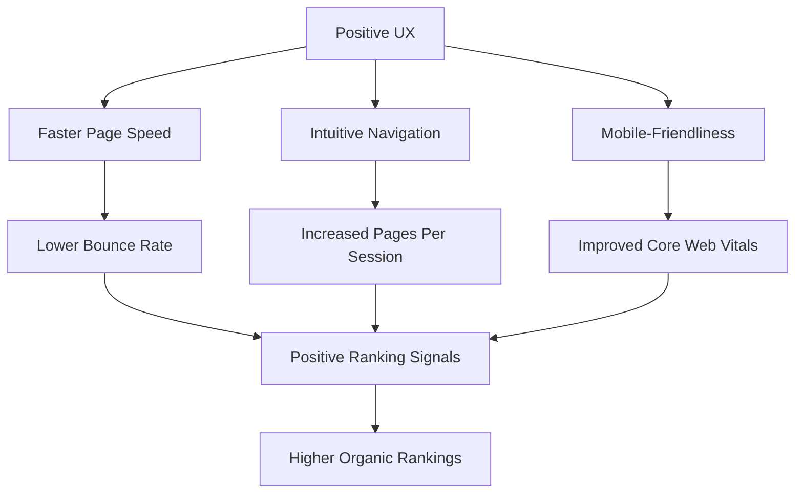
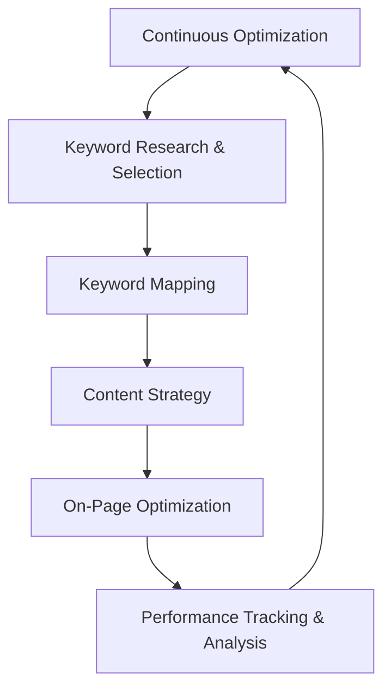
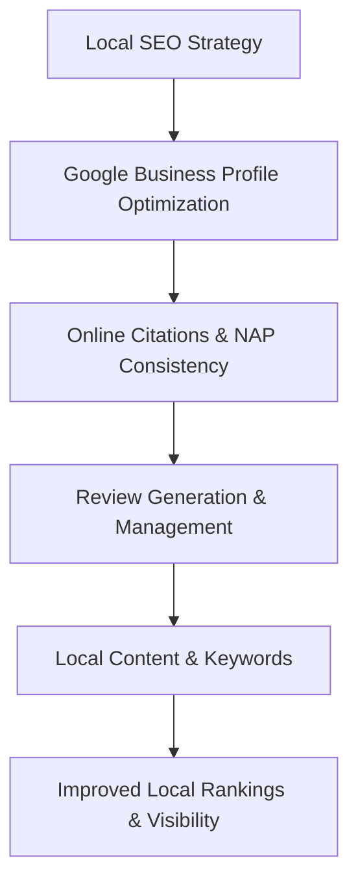
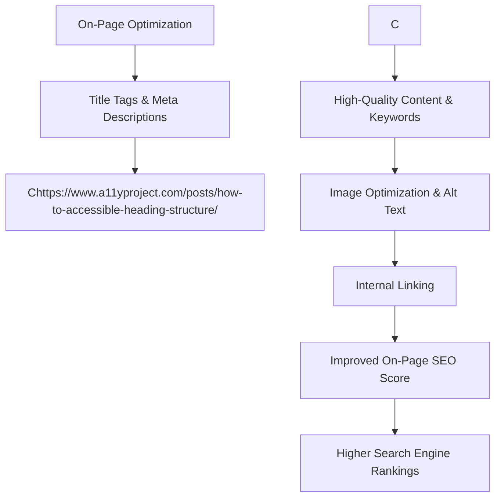

### 1\. Investigate the impact of user experience on SEO and search rankings. Describe the key elements of a website's user experience that search engines consider important, and provide suggestions for improving user satisfaction.

**Definition:**

**User Experience (UX)** in the context of SEO refers to how a person feels when interacting with a website. It encompasses all aspects of the user's interaction with the site, including its ease of use, design, accessibility, and content relevance. Search engines, particularly Google, have shifted their focus to rewarding websites that provide a superior UX because their ultimate goal is to deliver the most valuable and satisfying result to a user's query. A positive UX leads to higher **dwell time**, lower **bounce rates**, and a higher **click-through rate (CTR)**, which are all strong **ranking signals**.

**Simple Example:**

Consider two online clothing stores. Store A has a cluttered homepage, a slow-loading product catalog, and a confusing checkout process. Store B has a clean design, fast-loading images, and a one-click checkout. A user is more likely to spend time on Store B, browse more pages, and complete a purchase. Google's algorithms detect this positive user behavior and will likely rank Store B higher for relevant search queries, as it provides a better overall experience.

**Diagram:**



**Key Elements of UX that Influence Search Rankings:**

1.  **Page Speed:** This is a crucial UX factor directly measured by Google through its **Core Web Vitals** initiative. A fast-loading website reduces user frustration and decreases the bounce rate. Google’s Largest Contentful Paint (LCP) and First Input Delay (FID) metrics are direct measures of how quickly a page loads and becomes interactive.

2.  **Mobile-Friendliness:** With **mobile-first indexing**, a website's mobile experience is the primary factor for its ranking. A mobile-friendly site with a **responsive design**, legible text, and easy-to-tap buttons is essential. An un-optimized mobile site will likely suffer in rankings, as a large portion of searches are now conducted on mobile devices.

3.  **Site Navigation & Information Architecture:** A clear, logical, and intuitive site structure allows users to easily find the information they need. A well-designed site with an internal linking strategy helps users navigate from one page to another, increasing **pages per session** and signaling to search engines that the content is relevant and well-organized.

**Suggestions for Improving User Satisfaction:**

  * **Improve Page Speed:** Compress images, leverage browser caching, and minify CSS and JavaScript files.
  * **Implement a Responsive Design:** Ensure your website's layout automatically adjusts to different screen sizes.
  * **Enhance Readability:** Use short paragraphs, clear subheadings, and a legible font. Break up text with bullet points, numbered lists, and relevant images.
  * **Streamline Navigation:** Use a simple, consistent menu structure and a search bar to help users find content quickly.

**Real-World Case:**

In 2021, a study published by **Portent** found that a 1-second improvement in site speed resulted in a **2.7% increase in conversion rate**. For a large e-commerce site like **Amazon**, improving page speed has been a continuous focus. By prioritizing a fast, seamless user experience, they have not only driven billions in revenue but have also maintained their dominance in search engine rankings by signaling high quality and reliability.

**References:**

1.  [HubSpot Blog: A Guide to User Experience (UX) for SEO](https://www.google.com/search?q=https://blog.hubspot.com/marketing/ux-and-seo)
2.  IEEE Paper: *The Impact of User Experience on Search Engine Rankings and Web Traffic (2020)*

**Practice Questions:**

1.  Justify why a high **dwell time** and a low **bounce rate** are considered positive signals for SEO.
2.  Explain the concept of **Core Web Vitals** and their significance in modern SEO strategy.
3.  Discuss the role of **internal linking** in improving both UX and a website's search engine rankings.

-----

### 2\. Propose a comprehensive keyword strategy for a specific online business niche or industry. Include details on the types of keywords to target, the content strategy to support it, and the methods to track the performance of the keyword strategy over time.

**Definition:**

A **keyword strategy** is a detailed, long-term plan for identifying, selecting, and using relevant keywords to achieve business goals in search engine marketing (SEM). It is the backbone of any successful digital marketing campaign, ensuring that all content creation and optimization efforts are aligned with what the target audience is actually searching for. A comprehensive strategy moves beyond simply finding keywords to understanding **user intent**, competition, and the overall customer journey.

**Simple Example:**

For an online yoga studio, a comprehensive keyword strategy would not just target the broad keyword "yoga classes." It would also target:

  * **Informational keywords:** "benefits of yoga for beginners," "how to choose a yoga mat."
  * **Transactional keywords:** "online yoga classes subscription," "buy yoga retreat tickets."
  * **Local keywords:** "yoga studio in Bangalore," "yoga classes near me."
    This tiered approach ensures the business captures users at every stage of the **conversion funnel**, from initial research to making a purchase.

**Diagram:**



**Comprehensive Keyword Strategy for an Online Yoga Studio:**

**1. Types of Keywords to Target:**

  * **Head/Short-Tail Keywords (High Volume, High Competition):** "yoga," "yoga classes." These are for long-term brand building and are often supported by PPC campaigns.
  * **Mid-Tail Keywords (Medium Volume, Medium Competition):** "online yoga classes for beginners," "power yoga at home." These keywords are often the focus of high-quality, comprehensive blog posts and dedicated landing pages.
  * **Long-Tail Keywords (Low Volume, Low Competition):** "30-day yoga challenge for flexibility," "best yoga poses for back pain relief." These keywords have specific **user intent** and are highly effective for creating targeted content that leads to high conversion rates.

**2. Content Strategy to Support It:**

  * **Pillar Content:** Create a long, comprehensive "pillar page" on a broad topic, such as "A Beginner's Guide to Yoga." This page will target the mid-tail keyword "yoga for beginners" and cover all related sub-topics.
  * **Cluster Content:** Create multiple smaller blog posts or articles that dive deep into specific long-tail keywords, such as "5 Yoga Poses for Better Sleep" or "How to Choose Your First Yoga Mat." These articles will link back to the main pillar page, strengthening its authority.
  * **Transactional Pages:** Create a dedicated landing page for transactional keywords like "online yoga subscription," with clear calls to action (CTAs) and pricing information.

**3. Methods to Track Performance:**

  * **Keyword Rankings:** Use tools like SEMrush or Ahrefs to monitor your site's ranking for target keywords. Track progress over time to see if your content strategy is working.
  * **Organic Traffic:** Monitor organic search traffic in **Google Analytics**. An increase in organic traffic to your targeted pages is a direct sign of success.
  * **Conversions:** Track **conversion rates** from organic traffic. For the yoga studio, this would include subscriptions, trial sign-ups, and sales of merchandise. This metric shows the true **ROI** of your keyword strategy.
  * **Google Search Console:** Use this free tool to see which queries users are using to find your site. This can reveal new keyword opportunities and areas for content improvement.

**Real-World Case:**

In 2022, the online meditation app **Calm** executed a similar strategy. They went beyond targeting the competitive keyword "meditation" and created content clusters around long-tail, high-intent keywords like "meditation for sleep," "anxiety relief meditation," and "mindfulness for kids." By tracking their organic traffic and subscription conversions from these specific pages, they demonstrated that their long-tail keyword strategy was a key driver of their app's growth and subscriber base.

**References:**

1.  [Neil Patel Blog: The Ultimate Guide to Keyword Strategy](https://www.google.com/search?q=https://neilpatel.com/blog/comprehensive-keyword-strategy/)
2.  IEEE Paper: *Keyword Strategy in Digital Marketing: A Framework for Search Engine Optimization and Analytics (2019)*

**Practice Questions:**

1.  Explain the concept of **keyword intent** and why it is crucial for a successful keyword strategy.
2.  Justify why targeting **long-tail keywords** is often more effective for new websites than targeting short-tail keywords.
3.  Discuss the role of **competitive analysis** in developing a keyword strategy.

-----

### 3\. Examine the role of local SEO in an SEO strategy for businesses with physical locations or specific geographical target markets. What local SEO tactics can help businesses improve their visibility in local search results?

**Definition:**

**Local SEO** is the process of optimizing a business's online presence to rank higher in local search results. It is essential for businesses with a physical storefront or those that serve a specific geographic area (e.g., plumbers, restaurants, dentists). Local SEO focuses on keywords with local intent (e.g., "café near me") and signals like **NAP (Name, Address, Phone Number) consistency**, online reviews, and location-specific content. It is a critical part of a broader SEO strategy for businesses that rely on foot traffic or local service inquiries.

**Simple Example:**

A user on a smartphone searches for "bookstore in Chennai." Google's local pack shows three results with a map. The bookstore that appears at the top has claimed its **Google Business Profile**, has dozens of positive customer reviews, and has consistent business information across online directories like JustDial and Yellow Pages. This bookstore has a strong local SEO presence, making it the most visible and trustworthy option for the user.

**Diagram:**



**Local SEO Tactics to Improve Visibility:**

1.  **Optimize Your Google Business Profile (GBP):** This is the most crucial local SEO tactic. Businesses must claim and verify their GBP. The profile should be completely filled out with accurate information:

      * **Name, Address, Phone Number (NAP):** Must be consistent.
      * **Categories:** Select the most relevant business categories.
      * **Description & Photos:** Write a compelling description and upload high-quality photos of the business's interior, exterior, and products/services.
      * **Posts & Q\&A:** Use the GBP's features to post updates, answer customer questions, and engage with the community.

2.  **Build Online Citations and Ensure NAP Consistency:** A **citation** is any online mention of your business’s NAP. These can be on local directories (JustDial, Sulekha), review sites (Yelp), or social media. Ensuring your NAP is consistent across all these platforms is a major ranking factor. Inconsistencies confuse search engines and can harm your ranking. Businesses should regularly audit their citations and use **local SEO tools** to ensure accuracy.

3.  **Generate and Manage Online Reviews:** Positive reviews are one of the most powerful signals in local SEO. Businesses should have a strategy to encourage satisfied customers to leave reviews on their GBP and other relevant platforms. Furthermore, businesses must respond to all reviews, both positive and negative. A prompt, professional response to a negative review can mitigate damage and show potential customers that you are responsive and care about customer service.

4.  **Create Localized Content:** Create content that targets local keywords and addresses the needs of your community. For a local bakery, this could be blog posts like "Best Birthday Cakes in Bangalore" or "Our Guide to Visiting Anna Nagar." This content not only attracts relevant local traffic but also signals to search engines that your business is a local authority.

**Real-World Case:**

A study by **Moz** in 2021 found that **Google Business Profile signals** and **reviews** were among the top ranking factors for local searches. A case in point is the growth of a local service provider like **Urban Company** (formerly UrbanClap). By optimizing their local listings, encouraging user reviews, and ensuring consistent NAP information for all their service providers across India, they have successfully dominated the local service search landscape, making them the go-to solution for on-demand services in urban areas.

**References:**

1.  [Moz Blog: The Top Local SEO Ranking Factors](https://www.google.com/search?q=https://moz.com/blog/local-seo-ranking-factors)
2.  IEEE Paper: *Local Search Engine Optimization: A Framework for Small Businesses (2018)*

**Practice Questions:**

1.  Explain the concept of the **Google Local Pack** and why it is a prime target for local SEO efforts.
2.  Discuss the role of **structured data (Schema Markup)** in enhancing a business's local SEO.
3.  Justify why building **local backlinks** is an important part of a local SEO strategy.

-----

### 4\. Illuminate the significance of on-page optimization for a website's search engine rankings. What are the key on-page factors that search engines consider important, and how can businesses leverage them to improve their visibility in search results?

**Definition:**

**On-Page Optimization** refers to all the actions taken directly on a website's pages to improve their position in search rankings. It is the process of aligning a page's content, code, and overall structure with the target keywords and **user intent**. On-page factors are the direct signals that a search engine's **crawlers** read to understand what a page is about, how relevant it is, and whether it deserves to be ranked highly.

**Simple Example:**

A business creates a new blog post about "how to bake a perfect cheesecake." If they only use the phrase once, a search engine might not understand the page's topic. By including the keyword in the **title tag**, the **URL**, the **H1 heading**, and naturally throughout the content, they provide clear signals to the search engine. They also use related keywords like "cheesecake recipe" and "baking tips," making the page more comprehensive and relevant, thus improving its chances of ranking well.

**Diagram:**



**Key On-Page Factors and How to Leverage Them:**

1.  **Title Tags and Meta Descriptions:** These are the first things a user sees on the **search engine results page (SERP)**. The **title tag** should include the primary keyword and be compelling enough to encourage a click. The **meta description** should be a concise summary of the page's content, using keywords and a clear value proposition. While the meta description is not a direct ranking factor, a well-written one can significantly improve the page's **click-through rate (CTR)**, which is a strong ranking signal.

2.  **High-Quality, Relevant Content:** Content is the most important on-page factor. It must be unique, comprehensive, and satisfy **user intent**. The content should naturally include the target keyword and related semantic keywords. Providing in-depth answers, using multimedia (images, videos), and regularly updating content for **freshness** are key strategies.

3.  **Heading Structure (H1, H2, H3):** Headings organize content and make it scannable for both users and search engine crawlers. The main topic of the page should be in a single **H1 tag**. Subsequent subheadings (**H2, H3**) should break down the content and may include variations of the main keyword. A logical heading structure improves both readability and a search engine's understanding of the page's hierarchy.

4.  **Internal Linking and URL Structure:** A clear URL structure (e.g., `yourwebsite.com/category/page-title`) provides a breadcrumb trail for users and search engines. **Internal linking** (links from one page on your site to another) helps search engines discover new pages and distributes **page authority** across your site. It also encourages users to explore more content, increasing **pages per session** and **dwell time**.

**Real-World Case:**

In 2022, **Wikipedia** was cited by Ahrefs as a prime example of effective on-page optimization. The site consistently ranks at the top for millions of queries due to its meticulous use of headings, a robust internal linking structure, and incredibly in-depth, high-quality content that satisfies every conceivable user intent for a given topic. This demonstrates that mastering on-page fundamentals can lead to unparalleled search visibility.

**References:**

1.  [Ahrefs Blog: On-Page SEO: The Beginner's Guide](https://ahrefs.com/blog/on-page-seo/)
2.  IEEE Paper: *On-Page Optimization Techniques for Improved Website Visibility and Performance (2020)*

**Practice Questions:**

1.  Justify the importance of a page's **meta description** even though it is not a direct ranking factor.
2.  Explain the concept of **LSI keywords** and their role in creating high-quality, on-page optimized content.
3.  Discuss the role of **Core Web Vitals** in modern on-page optimization.

-----

### 5\. Investigate the role of ad copy and ad extensions in SEM. How can businesses create compelling and effective ad copies to improve their click-through rates (CTR) and ad performance?

**Definition:**

In **Search Engine Marketing (SEM)**, **ad copy** is the text that appears in a paid advertisement on a search engine results page (SERP). It is a critical component of a **Pay-Per-Click (PPC)** campaign, designed to capture a user's attention, communicate a value proposition, and drive a click. **Ad extensions** are additional pieces of information that can be added to an ad, such as a phone number, a physical address, or links to specific pages on a website. Both are essential for improving **ad relevance**, increasing **click-through rates (CTR)**, and ultimately, maximizing **return on investment (ROI)**.

**Simple Example:**

A user searches for "online marketing course."

  * **Ad Copy without extensions:** "Learn Digital Marketing. Enroll Today." (Generic and unappealing)
  * **Ad Copy with extensions:**
      * **Headline:** "Master Digital Marketing - Get Certified"
      * **Description:** "Enroll in our top-rated online course. Limited-time discount. Gain practical skills & job-ready expertise."
      * **Sitelink Extensions:** "Course Details," "Student Reviews," "Free Demo."
      * **Call Extension:** "Call Us Now"
        The second ad is far more compelling, informative, and actionable, making it more likely to receive a click.

**Diagram:**

```mermaid
graph TD
A[Compelling Ad Copy] --> B[High Ad Relevance & Quality Score]
B --> C[Increased Click-Through Rate (CTR)]
C --> D[More Qualified Clicks]
D --> E[Lower Cost Per Click (CPC) & Higher ROI]
E --> F[Improved Overall Ad Performance]
```

**Creating Compelling Ad Copies and Leveraging Ad Extensions:**

1.  **Align Ad Copy with User Intent:** The most effective ad copy directly answers the user's search query. If the user searches for "buy running shoes," the ad copy should contain transactional words like "Shop," "Sale," or "Order Now." If the search is "best running shoes," the ad should be informational, perhaps using phrases like "Top-Rated" or "Compare Our Collection." Aligning with **user intent** is crucial for ad relevance and a high **Quality Score**.

2.  **Highlight a Unique Value Proposition (UVP):** What makes your product or service better than the competition? The ad copy should clearly communicate this. Examples of UVPs include "Free Shipping," "24/7 Support," "30-Day Money-Back Guarantee," or "Made in India." This differentiates your ad and gives the user a reason to click.

3.  **Use Action-Oriented Language and Keywords:** The ad copy should contain a clear **call-to-action (CTA)**. Phrases like "Shop Now," "Learn More," "Get a Quote," or "Sign Up" guide the user on what to do next. Furthermore, including the target keyword in the ad's headline and description makes the ad more relevant to the user's search query, increasing its CTR.

4.  **Leverage Ad Extensions:** Ad extensions are a powerful way to make your ad more prominent and informative on the SERP, without paying for extra text.

      * **Sitelink Extensions:** Add links to specific pages on your site (e.g., "About Us," "Pricing," "Contact").
      * **Callout Extensions:** Highlight specific features or promotions (e.g., "Free Consultation," "Award-Winning Service").
      * **Structured Snippets:** Showcase specific categories of products or services (e.g., "Courses: SEO, PPC, Social Media").
      * **Call Extensions:** Allow users to call your business directly from the ad on mobile devices.

**Real-World Case:**

In 2021, **Microsoft Advertising** (formerly Bing Ads) published a case study on a small business that used ad extensions. By adding sitelink extensions and a call extension to their PPC campaigns, they saw a **25% increase in their CTR** and a **15% decrease in their cost-per-conversion**. This demonstrated how the extra real estate and useful information provided by extensions made their ads more effective, leading to a significant improvement in ad performance.

**References:**

1.  [HubSpot Blog: A Guide to Creating Effective PPC Ad Copy](https://www.google.com/search?q=https://blog.hubspot.com/marketing/ppc-ad-copy)
2.  IEEE Paper: *The Impact of Ad Copy and Ad Extensions on Click-Through Rates in Search Engine Marketing (2019)*

**Practice Questions:**

1.  Explain the concept of **Quality Score** in Google Ads and how compelling ad copy and extensions contribute to it.
2.  Discuss the role of **A/B testing** in optimizing PPC ad copy and why it is essential for improving ad performance.
3.  Justify why a **call extension** is a crucial ad extension for a service-based business with a physical location.
